# 第 1 章 五线谱、谱号与加线

## 和声学 (Harmony)

和声学 (harmony) 研究的是和弦 (chord) 以及和弦之间的相互关系。理解和声实践对于理解音乐语言至关重要。与学习任何语言一样，学习过程的第一步是建立词汇。

---

## 五线谱 (The Staff)

我们记谱系统的基础是由五条线组成的网格，称为**五线谱 (staff)**。

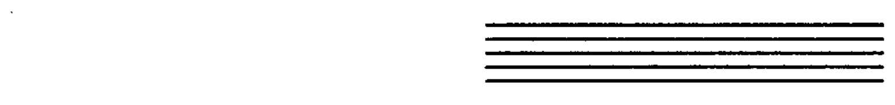

音符在五线谱上的位置直观地表示音高的相对"高低"。

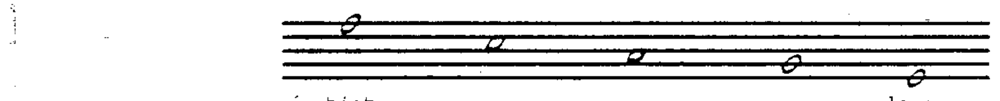

---

## 谱号 (Clefs)

五线谱上的每条线和每个间都可以被赋予一个字母名称。这些字母名称按字母升序排列：A B C D E F G。字母名称的位置由放置在五线谱开头的**谱号 (clef)** 来确定。

### F 谱号（低音谱号）

以下示例使用的是 **F 谱号** (F clef)，也称为**低音谱号 (bass clef)**。F 谱号将"中央 C (middle C)"以下的 F 音定位在五线谱的第四线上。

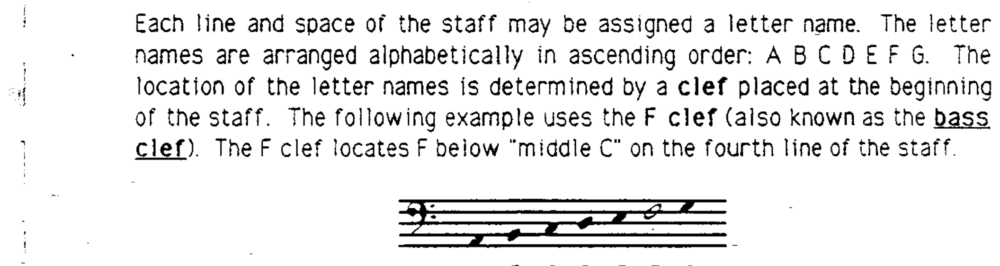

### G 谱号（高音谱号）

**G 谱号** (G clef)，也称为**高音谱号 (treble clef)**，将"中央 C"以上的 G 音定位在五线谱的第二线上。

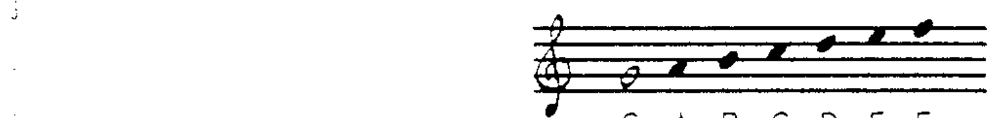

### C 谱号（中音谱号）

**C 谱号** (C clef) 将"中央 C"定位在五线谱的中线上（在某些情况下，定位在第四线上）。

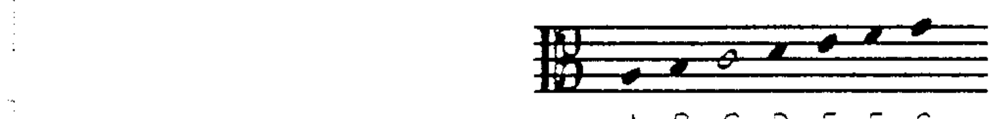

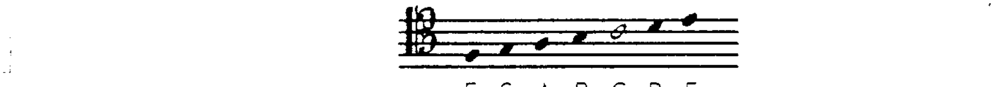

请注意，音乐字母表从 A 到 G，然后重新开始。

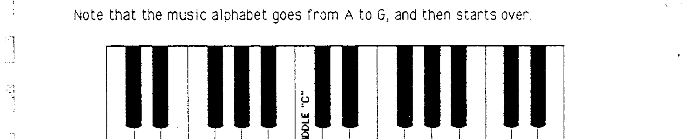

---

## 大谱表 (The Grand Staff)

当两行五线谱与高音谱号和低音谱号组合使用时，称为**大谱表 (Grand Staff)** 或 **Great Staff**。

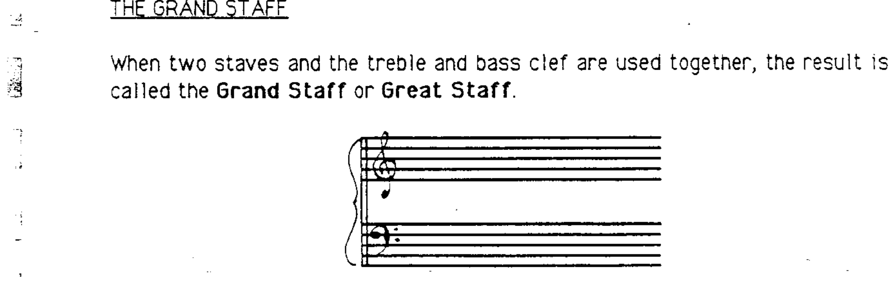

---

## 加线 (Leger Lines)

被称为**加线 (leger lines)** 的短小横线用于扩展五线谱的范围。

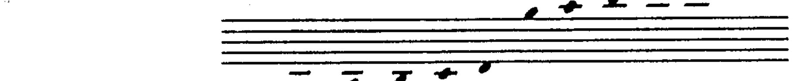

请注意，紧靠五线谱上方或下方间内的音符不需要添加加线。

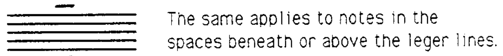

同样的规则适用于加线之间的间内音符。

---

## 总结

总结来说，音乐记谱中使用的音高定位方式有：

1. **五线谱 (staff)**——展示不同音符之间的高低关系。
2. **谱号 (clefs)**——确定五线谱各线和间上的音名。
3. **加线 (leger lines)**——将五线谱的五条线向上或向下延伸，以记写更高或更低的音。

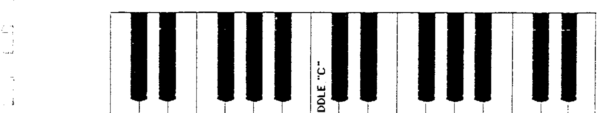

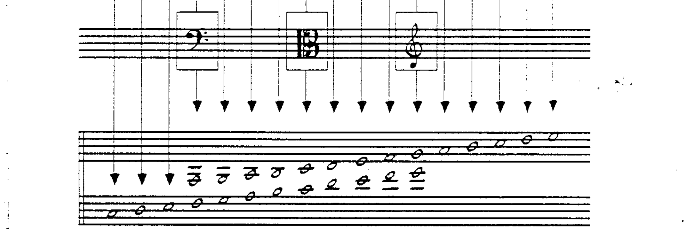

---

> **配套作业：第 1、2、3 题**
