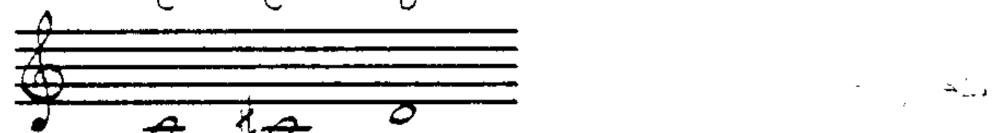
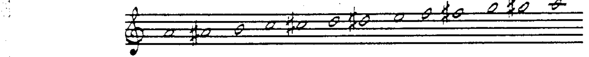
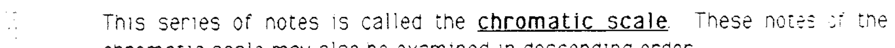
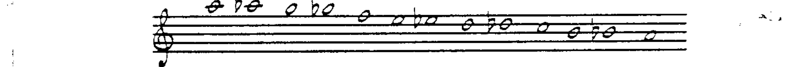
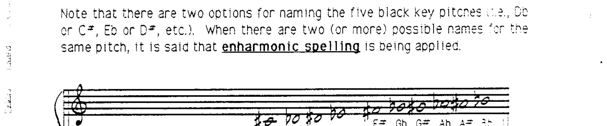
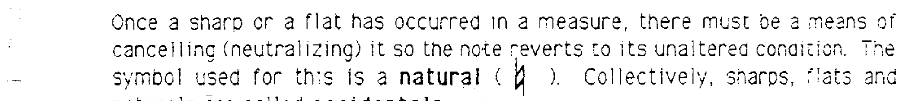
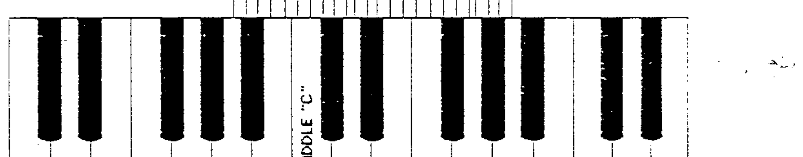
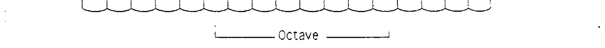
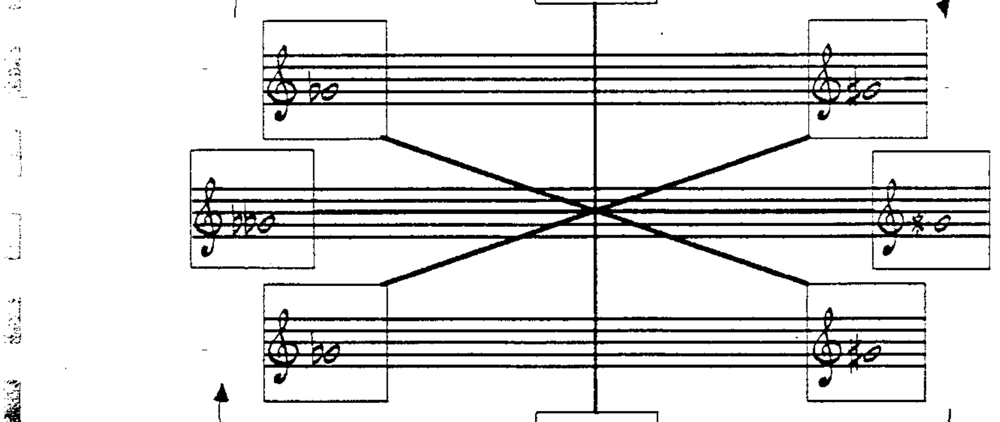

# 第 2 章 变音记号与等音

## 变音记号 (Accidentals)

前一章关于大谱表的内容涵盖了键盘上白键的字母名称。那么另外五个音（黑键）呢？

为了保持字母体系的完整性，这另外五个音高被表示为基本七个音高的**变化形式**。所使用的术语是**升号 (sharp)** 和**降号 (flat)**。升号 = 升高半音 (1/2 step)，记作 ♯；降号 = 降低半音，记作 ♭。"C♯"就是 C 上方半音、D 下方半音的那个音高。在记谱中，升号写在音符的前面。

---

## 半音阶 (The Chromatic Scale)

十二个音按升序排列的名称为：

> A — A♯ — B — C — C♯ — D — D♯ — E — F — F♯ — G — G♯ — A

这一系列音被称为**半音阶 (chromatic scale)**。半音阶中的音也可以用降序来考察。

与升号一样，降号也写在它所作用的音符前面。

> A — A♭ — G — G♭ — F — E — E♭ — D — D♭ — C — B — B♭ — A

---

## 等音 (Enharmonic Spelling)

请注意，五个黑键音各有两种命名方式（D♭ 或 C♯、E♭ 或 D♯，等等）。当同一个音高有两种（或更多种）可能的名称时，就称为**等音 (enharmonic spelling)**。

---

## 还原记号 (The Natural Sign)

当一个升号或降号在某小节中出现后，必须有一种方法来取消（还原）它，使该音恢复到未变化的状态。用于此目的的符号是**还原记号 (natural)**，记作 ♮。升号、降号和还原记号统称为**变音记号 (accidentals)**。

在一个八度 (octave)——即八个连续字母名称——的范围内，共有**十二个半音**：

---

## 重升记号与重降记号 (Double-Sharp & Double-Flat)

在某些情况下，可能需要将一个音高升高或降低**两个半音**。用于此目的的符号分别是 **𝄪**（重升记号，double-sharp）和 **𝄫**（重降记号，double-flat）。这些符号同样属于变音记号。

---

## 变音记号规则 (Rules for Accidentals)

升号 (♯)、降号 (♭)、还原记号 (♮)、重升记号 (𝄪) 和重降记号 (𝄫) 的使用规则如下：

1. **还原记号可以取消升号或降号。**
2. **单个升号或降号可以分别取消重升记号或重降记号。**
3. **一个还原记号即可取消重升记号和重降记号。**
4. **变音记号在其所在小节内持续有效**，或在连音线 (tie) 持续期间有效——无论是在小节内还是跨越小节线。
5. **要将已升高的音再升高，使用重升记号；要将已降低的音再降低，使用重降记号。**
6. **变音记号仅影响特定谱号中特定八度内的该音。** 同名的其他八度的音不受影响。

---

> **配套作业：第 4、5、6、7、8 题**
