# 第 4 章 音阶

## 音阶的定义 (Scales)

**音阶 (scale)** 是由一系列按级进方式上行或下行排列的音所构成的序列。

---

## 半音阶 (The Chromatic Scale)

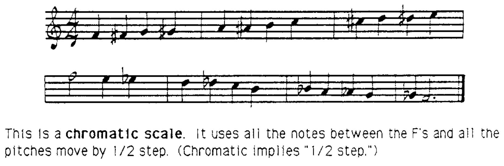

这是一个**半音阶 (chromatic scale)**。它使用了两个 F 之间的所有音符，每个音之间都是半音。"Chromatic"一词本身就意味着"半音"。

---

## 大调音阶 (The Major Scale)

以下音阶使用了从 C 到 C 的一个八度内的所有自然音：

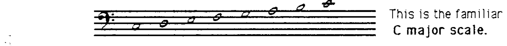

这就是 **C 大调音阶 (C major scale)**。

C 大调音阶的特征在于：**第 3 音到第 4 音** 之间以及 **第 7 音到第 1 音** 之间是半音；其余各音之间都是全音。这一排列模式为：

> **全 — 全 — 半 — 全 — 全 — 全 — 半**

所有大调音阶都遵循相同的音程排列模式。

如果将这一模式从 G 开始应用，得到的就是 **G 大调音阶**：

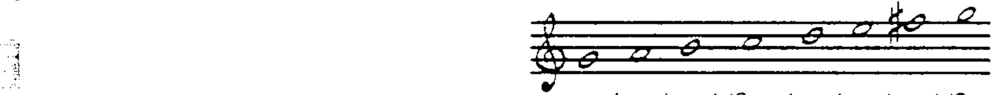

---

## 调式 (Modes)

同样的音（例如 C 大调音阶中的白键音）可以从不同的音开始和结束：

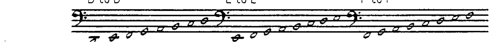

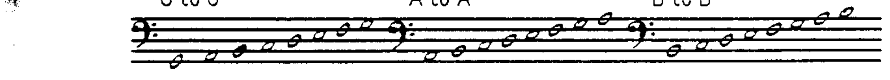

上述这些都是音阶，但它们并不是同一种音阶。C 大调音阶的特征是半音位于第 3—4 音级和第 7—1 音级之间。在其他各调式中，半音（E 到 F 与 B 到 C）出现在音阶的不同位置，由此产生了一组相互关联的音阶，称为**调式 (modes)**。

上面展示的调式都是**相对于 C 大调音阶**的（即 relative to C）。这意味着每个调式都在 C 大调音阶的不同音级上起止。

---

## 调式特征表 (Mode Characteristics)

| 调式名称 | 英文名 | 半音位于音级之间 | 与 C 大调的关系 |
|----------|--------|-----------------|----------------|
| Ionian（大调） | Ionian (major) | 3—4、7—1 | C 到 C |
| Dorian | Dorian | 2—3、6—7 | D 到 D |
| Phrygian | Phrygian | 1—2、5—6 | E 到 E |
| Lydian | Lydian | 4—5、7—1 | F 到 F |
| Mixolydian | Mixolydian | 3—4、6—7 | G 到 G |
| Aeolian（小调） | Aeolian (minor) | 2—3、5—6 | A 到 A |
| Locrian | Locrian | 1—2、4—5 | B 到 B |

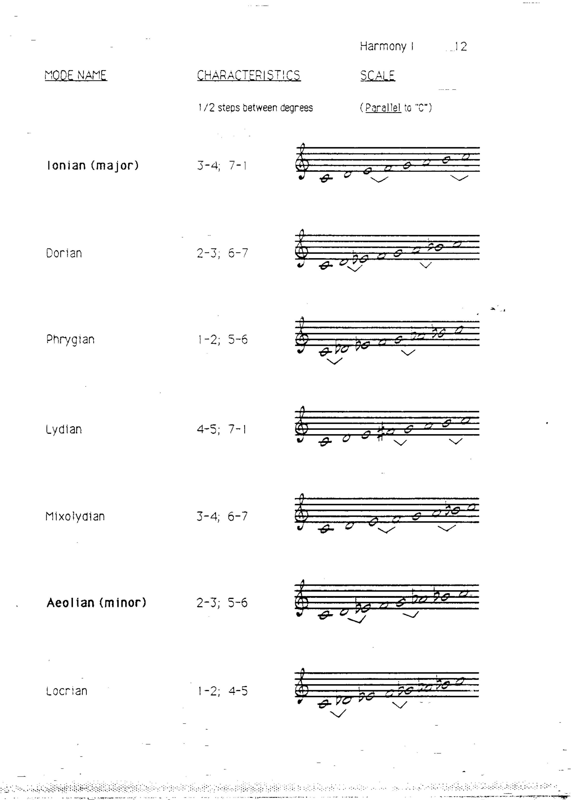

---

## 调式的平行描述 (Parallel Mode Descriptions)

调式也可以通过与**同主音 (parallel)** 的大调或小调音阶进行比较来描述。

### Dorian 调式

Dorian 调式可以描述为**小调音阶的第 6 音级升高**：

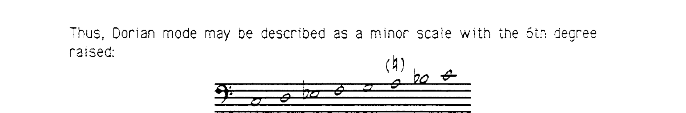

### Phrygian 调式

Phrygian 调式可以描述为**小调音阶的第 2 音级降低**：

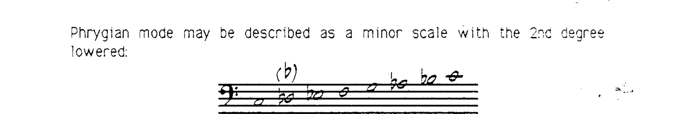

### Lydian 调式

Lydian 调式可以描述为**大调音阶的第 4 音级升高**：

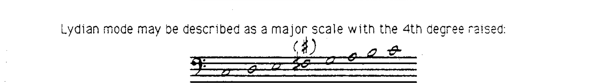

### Mixolydian 调式

Mixolydian 调式可以描述为**大调音阶的第 7 音级降低**：

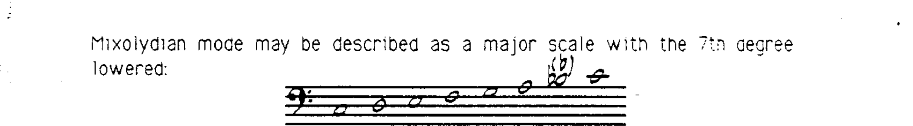

### Aeolian 调式

Aeolian 调式即**小调音阶 (minor scale)**：

### Locrian 调式

Locrian 调式可以描述为**小调音阶的第 2 和第 5 音级均降低**：

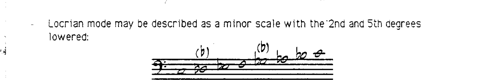
