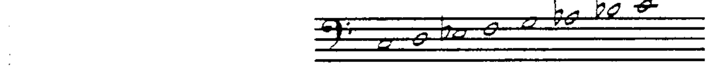
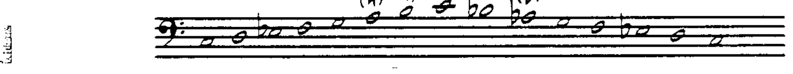
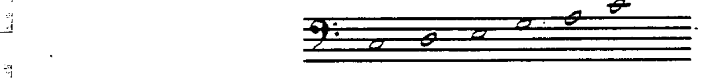

# 第 5 章 小调音阶与五声音阶

## 自然小调音阶 (Natural Minor Scale)

小调音阶（即 Aeolian 调式）又称**自然小调 (natural minor)** 或**纯小调 (pure minor)**：

其半音位于第 2—3 音级和第 5—6 音级之间。

---

## 和声小调音阶 (Harmonic Minor Scale)

**和声小调音阶 (harmonic minor scale)** 可以描述为将小调音阶的**第 7 音级升高**：

升高第 7 音级后，第 6 音级与第 7 音级之间出现了一个**增二度 (augmented second)**（即三个半音的距离），这是和声小调音阶独特的音响特征。

---

## 旋律小调音阶 (Melodic Minor Scale)

**旋律小调音阶 (melodic minor scale)** 可以描述为将小调音阶的**第 6 和第 7 音级同时升高**（上行形式）；下行时，旋律小调音阶恢复为纯小调：

---

## 大调五声音阶 (Major Pentatonic Scale)

**大调五声音阶 (major pentatonic scale)** 是一个五音音阶。它包含大调音阶中的第 1、2、3、5、6 音级，**不包含任何半音**。

---

> **配套作业：第 9、10 题**
