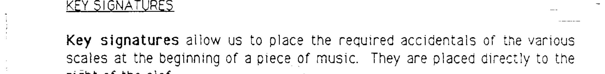
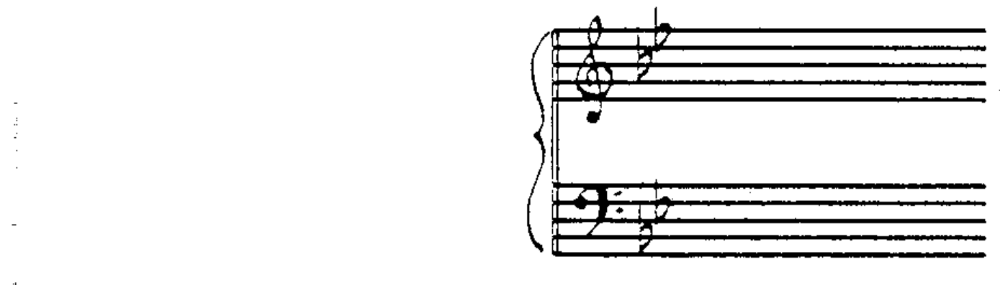
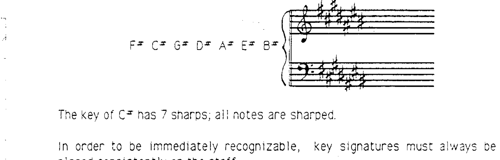
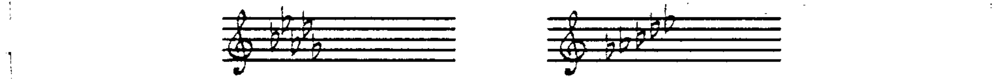
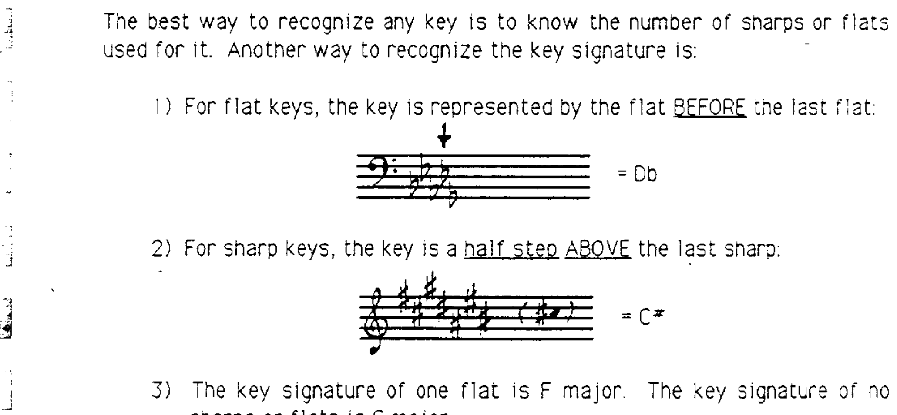

# 第 6 章 调号

## 调号 (Key Signatures)

**调号 (key signature)** 使我们可以将各音阶中所需的变音记号统一放置在乐曲的开头。调号紧跟在谱号的右侧：

演奏者在读谱之前，会先查看调号并注意其中标注的变音记号——这些变音记号将作用于全曲中所有受影响的音。将调号放在开头可以让调性一目了然，即使后续出现大量临时变化音也不会混淆。

---

## 五度循环与降号调 (Cycle of 5ths — Flat Keys)

请回顾作业中音阶的排列顺序（C、G、D、A……）。这一顺序源自一个贯穿音乐学习始终的现象——**五度循环 (cycle of 5ths)**。

按照五度循环的逻辑来构建调号：降号调中，降号的排列顺序遵循**下行五度循环**：

> B♭ — E♭ — A♭ — D♭ — G♭ — C♭ — F♭

C♭ 大调有 7 个降号（所有音均被降低）。

---

## 五度循环与升号调 (Cycle of 5ths — Sharp Keys)

升号调中，升号的排列顺序遵循**上行五度循环**：

> F♯ — C♯ — G♯ — D♯ — A♯ — E♯ — B♯

C♯ 大调有 7 个升号（所有音均被升高）。

---

## 调号的正确书写 (Correct Placement)

为了便于快速识别，调号必须始终在五线谱上保持一致的位置书写：

---

## 快速识别调号的方法 (Recognizing Key Signatures)

识别调号的最佳方法是记住每个调使用的升号或降号数量。此外，还有以下快捷方法：

1. **降号调**：调号由倒数第二个降号所代表的音名确定。

2. **升号调**：调号由最后一个升号上方半音的音名确定。

3. **特殊情况**：一个降号的调号是 F 大调；没有升号或降号的调号是 C 大调。

---

## 调号与八度 (Key Signatures and Octaves)

请注意，调号中的变音记号无需使用加线来书写。与一般变音记号规则不同的是，**调号对同名的所有八度中的音均有效**。

---

> **配套作业：第 11 题**
