# 第 7 章 音程

## 音程的定义 (Intervals)

在之前的音阶学习中，相邻音之间的关系为全音或半音。作为音乐词汇的一部分，我们需要一种方法来描述**任意两个音之间的关系**。

为此，我们需要一种合理的方式来表示两个音之间的距离，即**音程 (interval)**。

最简单的方法是：计算五线谱上从一个音到另一个音之间所跨越的每一个音级数，找出高音所代表的度数。

> 例如：从 C 向上数 C-D-E-F-G = 5，所以是五度 (5th)；C-D-E-F = 4，所以是四度 (4th)。

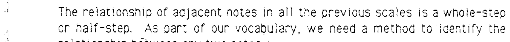

---

## 大调音阶中的音程 (Intervals in the Major Scale)

大调音阶中，第一个音与其他各音之间的音程如下：

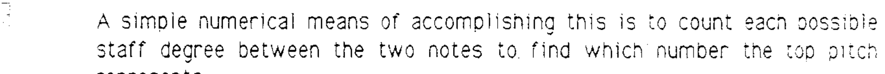

| 音程 | 性质 |
|------|------|
| 一度 (unison) | 纯 (perfect) |
| 二度 (2nd) | 大 (major) |
| 三度 (3rd) | 大 (major) |
| 四度 (4th) | 纯 (perfect) |
| 五度 (5th) | 纯 (perfect) |
| 六度 (6th) | 大 (major) |
| 七度 (7th) | 大 (major) |
| 八度 (octave) | 纯 (perfect) |

---

## 小音程 (Minor Intervals)

当一个**大音程 (major interval)** 缩小半音（降低上方音或升高下方音）时，该音程变为**小音程 (minor interval)**：

> 小二度 (minor 2nd)、小三度 (minor 3rd)、小六度 (minor 6th)、小七度 (minor 7th)

注意：音程可以是**旋律音程 (melodic interval)**（两音先后出现），也可以是**和声音程 (harmonic interval)**（两音同时发响）。

---

## 减音程 (Diminished Intervals)

当一个**小音程**或**纯音程**缩小半音时，变为**减音程 (diminished interval)**：

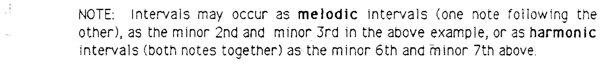

在所有音程关系中，必须先计算五线谱上涉及的音级数，然后再确定音程性质。

---

## 增音程 (Augmented Intervals)

当一个**大音程**或**纯音程**扩大半音时，变为**增音程 (augmented interval)**：

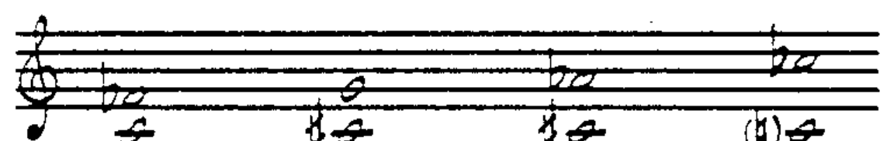

---

## 倍减与倍增音程 (Double Diminished & Double Augmented)

减音程再缩小半音变为**倍减音程 (double diminished)**：

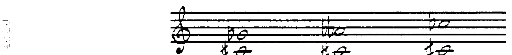

增音程再扩大半音变为**倍增音程 (double augmented)**：

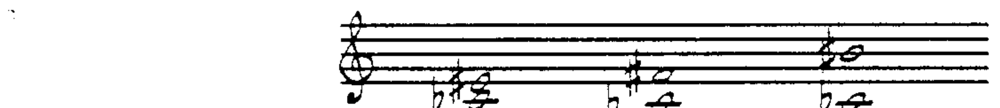

---

## 超过八度的音程 (Compound Intervals)

音程也可以超过八度的范围：

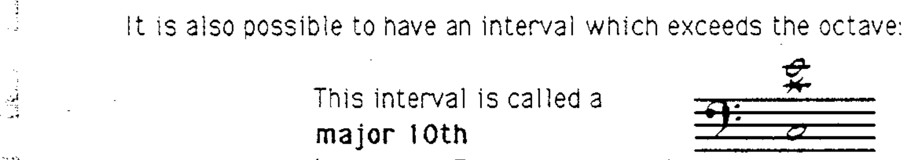

> 例如：大十度 (major 10th) = 大三度 + 八度。

---

## 音程规则总结 (Summary of Interval Rules)

以大调音阶的第一个音向上为基准：

1. 二度、三度、六度和七度是**大音程 (major)**。
2. 一度、四度、五度和八度是**纯音程 (perfect)**。
3. 大音程缩小半音 → **小音程 (minor)**。
4. 大音程缩小两个半音 → **减音程 (diminished)**。
5. 纯音程缩小半音 → **减音程 (diminished)**。
6. 纯音程缩小两个半音 → **倍减音程 (double diminished)**。
7. 大音程或纯音程扩大半音 → **增音程 (augmented)**；扩大两个半音 → **倍增音程 (double augmented)**。

---

> **配套作业：第 12、13 题**

---

## 音程的转位 (Inversion of Intervals)

音程描述的是两个音之间的距离。这两个音可以有两种排列方式：

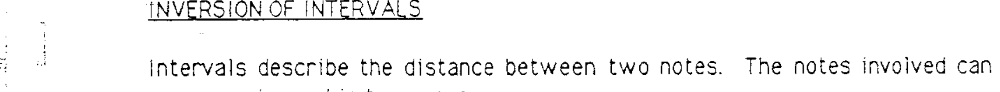

换言之，任何音程都可以被**上下颠倒（转位）**。

当一个音程转位后，所涉及的音名不变，但音程关系遵循以下规律：

### 转位规则

1. **9 减去原音程度数 = 转位后的度数**

> 例如：9 − 2（二度）= 7（七度）；9 − 7（七度）= 2（二度）

2. **大音程转位后变为小音程**

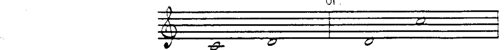

3. **小音程转位后变为大音程**

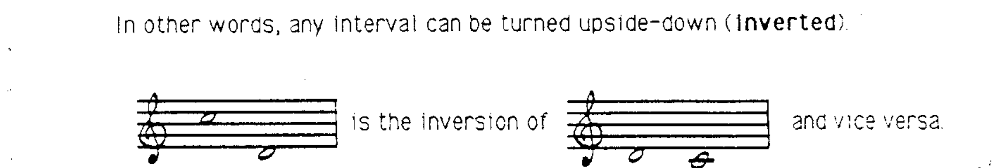

4. **纯音程转位后仍为纯音程**

5. **增音程转位后变为减音程**

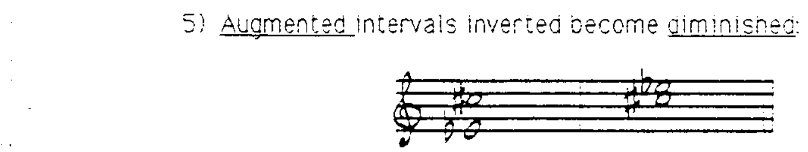

6. **减音程转位后变为增音程**

7. **倍减音程转位后变为倍增音程**

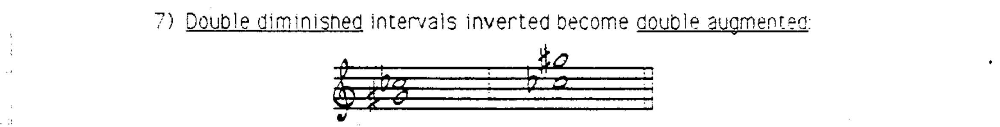

8. **倍增音程转位后变为倍减音程**

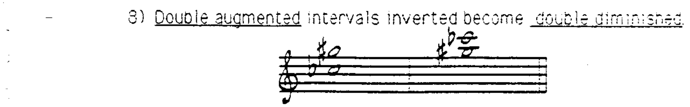

正确的音程转位方法是将**下方音升高八度**或将**上方音降低八度**。纯一度转位后变为纯八度，反之亦然。

---

## 三全音 (The Tritone)

**三全音 (tritone)**——即增四度——是一个特殊的音程。与其他音程不同，当它转位后，度数和性质都发生了变化，但仍然是一个三全音：

- 增四度（三全音 = 3 个全音）→ 转位后变为减五度（仍然是三全音 = 3 个全音）

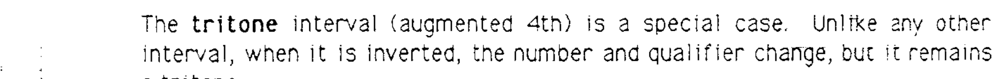

---

> **配套作业：第 14 题**
