# 第 8 章 和弦构造：三和弦与七和弦

## 三和弦 (Triads)

我们已经学习了音阶中的单音以及音程中的两音关系。现在，我们将三个音叠置在一起构成**和弦 (chord)**。

描述三音和弦所使用的术语与之前相同：大 (major)、小 (minor)、增 (augmented) 和减 (diminished)。（"纯 (perfect)"仅用于音程。）

三音和弦称为**三和弦 (triad)**。构建三和弦的基本单位是**三度音程**。首先以大调音阶为基础：

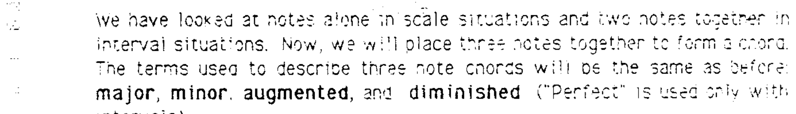

在音阶的每个音上方叠加两个音——第一个音是该音上方的三度音，第二个音是第一个叠加音上方的三度音：

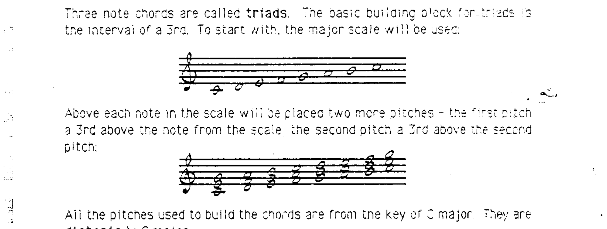

所有用来构建和弦的音都来自 C 大调调内音，即**自然音阶内 (diatonic)** 的音。

---

## 三和弦的类型

C 大调中的自然三和弦包含四种三和弦类型中的三种（大、小、减）。通过分析每个和弦内部的音程关系，可以看出这三种和弦的特征：

### 1. 大三和弦 (Major Triads)

从根音 (root) 到中间音为**大三度**，从根音到最高音为**纯五度**：

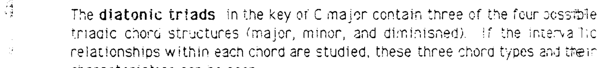

### 2. 小三和弦 (Minor Triads)

从根音到中间音为**小三度**，从根音到最高音为**纯五度**：

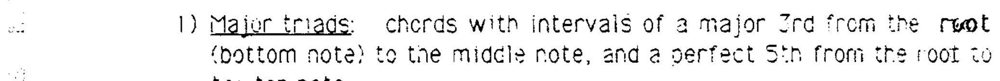

### 3. 减三和弦 (Diminished Triad)

从根音到中间音为**小三度**，从根音到最高音为**减五度**：

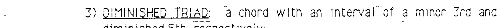

请注意，在所有情况下，三和弦的字母名称指的是**最下方的音**，即和弦的**根音 (root)**。

---

## 罗马数字标记 (Roman Numeral Analysis)

每个和弦还会用**罗马数字**来标记，代表其根音在音阶中的级数：

> I maj — II min — III min — IV maj — V maj — VI min — VII dim — I maj

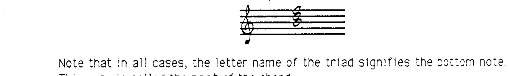

---

## 和弦符号缩写 (Chord Symbol Abbreviations)

以下是三和弦常用的通用缩写：

| 和弦类型 | 符号 | 示例 |
|---------|------|------|
| 大三和弦 | 字母名（可选 "major" 或 "maj"） | C 或 C maj |
| 小三和弦 | "min" 或 "-"（本课程使用 "-"） | A- |
| 减三和弦 | "dim" 或 "°" | Bdim 或 B° |

自然音阶三和弦的两种写法：

> I maj — II min — III min — IV maj — V maj — VI min — VII dim — I maj
>
> I — II- — III- — IV — V — VI- — VII° — I

---

## 增三和弦 (Augmented Triad)

第四种三和弦类型是**增三和弦 (augmented triad)**，缩写为 "aug" 或 "+"。增三和弦从根音起有**大三度**和**增五度**：

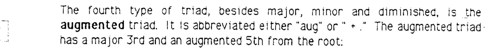

增三和弦**不属于任何大调的自然音阶和弦**，其用法将在后续讨论。

---

## 挂四和弦 (Suspended 4th Chord)

还有一种在当代音乐中非常常见的和弦，它不符合常规的三度叠置模式——**挂四和弦 (sus4)**。在 sus4 和弦中，**四度音替代了三度音**：

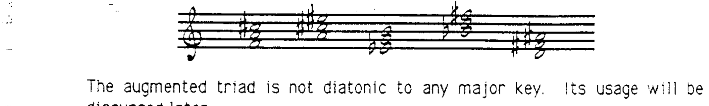

---

## 三和弦总结

| 类型 | 构造 | 示例 |
|------|------|------|
| 大三和弦 (Major) | 大三度 + 纯五度 | C |
| 小三和弦 (Minor) | 小三度 + 纯五度 | C- |
| 减三和弦 (Diminished) | 小三度 + 减五度 | Cdim |
| 增三和弦 (Augmented) | 大三度 + 增五度 | C+ |

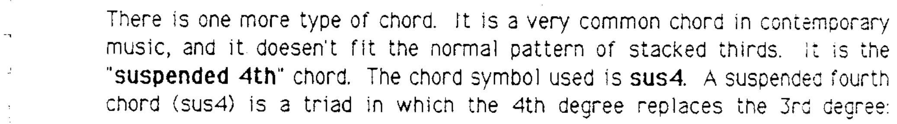

---

> **配套作业：第 15 题**

---

## 七和弦 (Seventh Chords)

自然三和弦的合理延伸是在五度音上方再叠加一个自然音阶内的三度音：

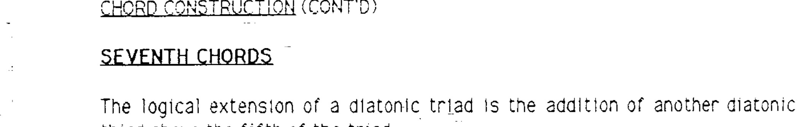

由此得到的是一个**自然七和弦 (diatonic seventh chord)**，其根音上方包含一个自然七度。

三和弦中只有三种音程关系（根音到三度、根音到五度、三度到五度）；加入七度后，音程关系的复杂度翻倍（根音到三度、五度、七度；三度到五度、七度；五度到七度）。因此，七和弦比三和弦更复杂。

---

## 七和弦的类型 (Types of Seventh Chords)

### 大七和弦 (Major 7th Chord)

根音起为**大三度、纯五度和大七度**：

> 符号：maj7 — 例如 Cmaj7、Fmaj7

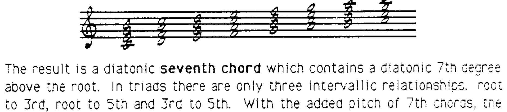

### 小七和弦 (Minor 7th Chord)

根音起为**小三度、纯五度和小七度**：

> 符号：-7 — 例如 D-7、E-7、A-7

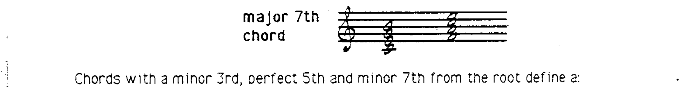

### 属七和弦 (Dominant 7th Chord)

根音起为**大三度、纯五度和小七度**：

> 符号：7 — 例如 G7

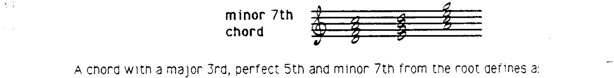

### 半减七和弦 (Half-Diminished 7th Chord)

根音起为**小三度、减五度和小七度**：

> 符号：-7(♭5) — 例如 B-7(♭5)

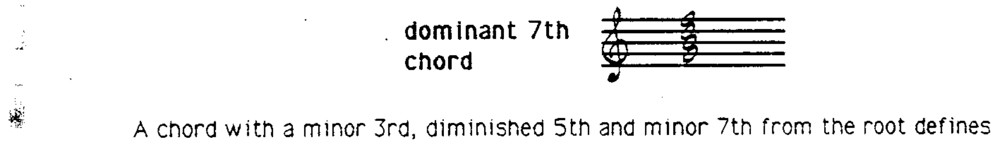

---

## 七和弦与三和弦的关系

将七和弦与其所基于的三和弦进行对比：

- C 和 F 上的和弦 = **大三和弦 + 大七度** → Cmaj7、Fmaj7
- D、E 和 A 上的和弦 = **小三和弦 + 小七度** → D-7、E-7、A-7
- G 上的和弦 = **大三和弦 + 小七度** → G7
- B 上的和弦 = **减三和弦 + 小七度** → B-7(♭5)

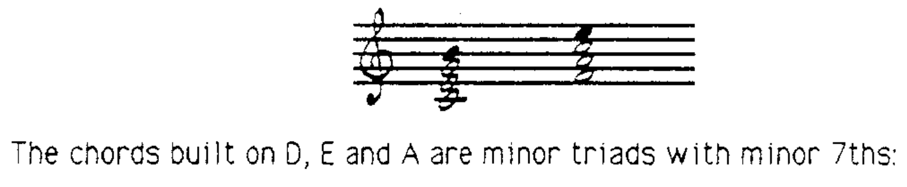

---

## 七和弦符号总结

| 符号 | 含义 |
|------|------|
| maj7 | 大三和弦 + 大七度 |
| -7 | 小三和弦 + 小七度 |
| 7 | 大三和弦 + 小七度 |
| -7(♭5) | 减三和弦 + 小七度 |

C 大调中的自然七和弦：

> Imaj7 — II-7 — III-7 — IVmaj7 — V7 — VI-7 — VII-7(♭5)
>
> Cmaj7 — D-7 — E-7 — Fmaj7 — G7 — A-7 — B-7(♭5)

---

## 其他七和弦类型 (Other 7th Chord Structures)

以下七和弦**不属于大调自然音阶和弦**：

### 增七和弦 (Augmented 7th Chord)

增三和弦 + 小七度，符号为 +7：

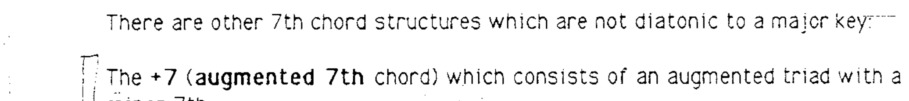

### 减七和弦 (Diminished 7th Chord)

减三和弦 + 减七度，符号为 °7 或 dim7：

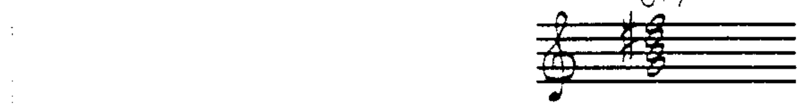

注意：在减七和弦中，减七度音程有时会使用等音记法。

### 小大七和弦 (Minor/Major 7th Chord)

小三和弦 + 大七度，符号为 -(maj7)：

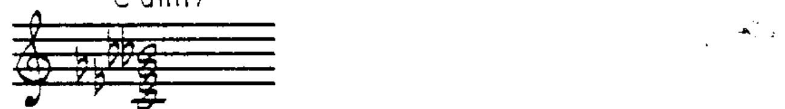

符号中 "-" 代表基本和弦色彩（小），"(maj7)" 表示七度的性质。括号是为了避免"小"与"大"混淆。

### 大六和弦与小六和弦 (6th Chords)

大三和弦或小三和弦分别加上一个"附加"六度音：

> 符号：C6（大六和弦）、C-6（小六和弦）

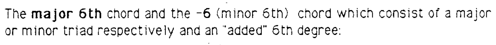

### 属七挂四和弦 (Dominant 7sus4 Chord)

挂四三和弦 + 小七度：

> 符号：7(sus4) — 例如 G7(sus4)

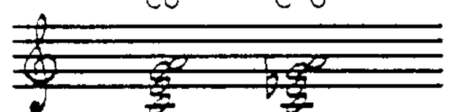

---

> **配套作业：第 16 题**
