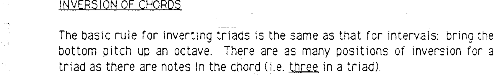
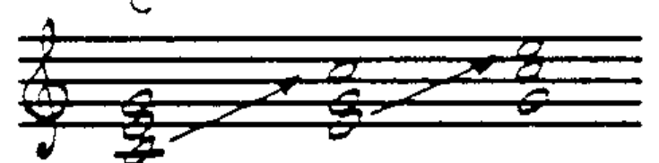
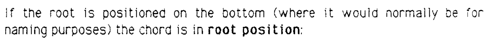
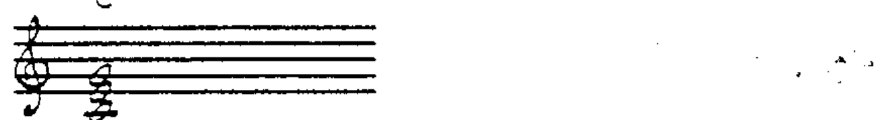
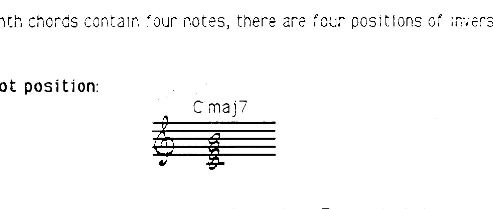
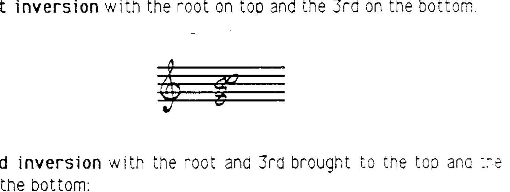
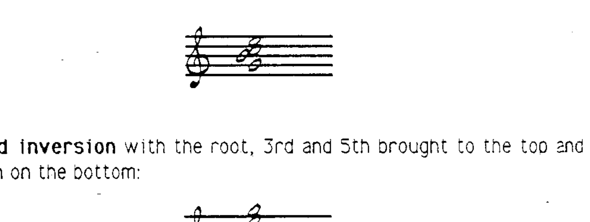
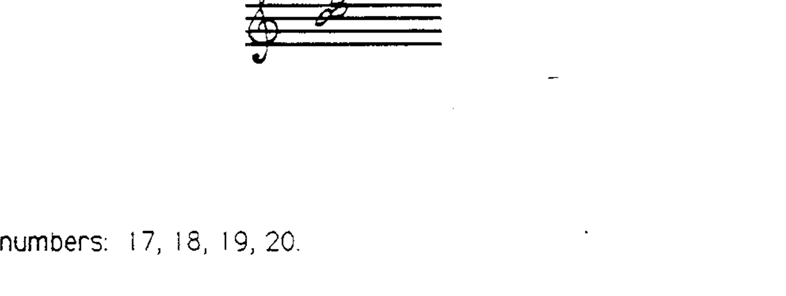

# 第 9 章 和弦转位

## 三和弦的转位 (Inversion of Triads)

三和弦转位的基本规则与音程转位相同：将最下方的音升高一个八度。三和弦有三个音，因此有三种排列位置：

### 原位 (Root Position)

当根音位于最下方时，和弦处于**原位 (root position)**：

### 第一转位 (First Inversion)

将根音升高一个八度，三度音成为最低音：

### 第二转位 (Second Inversion)

将根音和三度音都升高一个八度，五度音成为最低音：

再进行一次转位就会回到原位。请注意，三和弦的最高音有三种选择。

---

## 七和弦的转位 (Inversion of Seventh Chords)

由于七和弦包含四个音，因此有**四种排列位置**：

### 1. 原位 (Root Position)

根音在最底部：

### 2. 第一转位 (1st Inversion)

根音升至顶部，三度音在底部：

### 3. 第二转位 (2nd Inversion)

根音和三度音升至顶部，五度音在底部：

### 4. 第三转位 (3rd Inversion)

根音、三度音和五度音升至顶部，七度音在底部：

---

> **配套作业：第 17、18、19、20 题**
