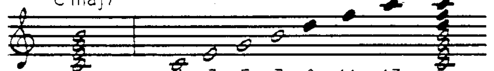
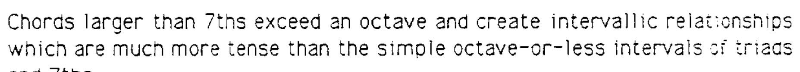
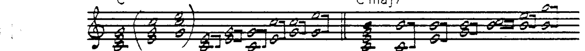
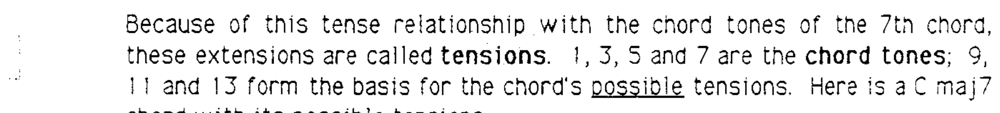
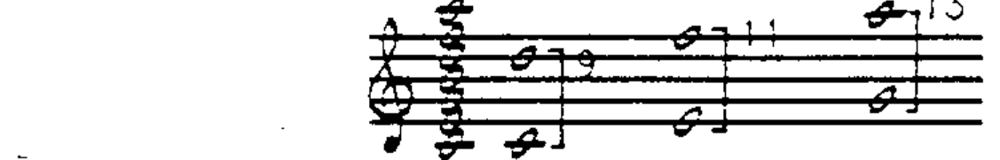

# 第 10 章 自然音阶和弦与延伸音

## 延伸音 (Tensions)

现在我们来考虑七和弦的进一步延伸：

大于七度的和弦超出了一个八度的范围，产生的音程关系比三和弦或七和弦中简单的八度内音程更为**紧张 (tense)**。

无论是何种转位，三和弦或七和弦中的所有音程都在八度以内：

将七和弦以三度音程尽可能向上扩展（不重复音高）：

现在这个和弦中有 **21 个音程关系**！七和弦（原位）有 6 个，三和弦有 3 个。音程数量远远超出了三倍，而七和弦只比三和弦多一倍。此外，现在还出现了**复合音程 (compound intervals)**——九度、十一度和十三度。

关于这些扩展七和弦，应注意以下事实：

1. 这些附加音高**不是**七和弦的和弦音 (chord tones)。
2. 它们与和弦音之间产生紧张的音程关系。

---

## 延伸音的定义

由于这些附加音与七和弦的和弦音之间存在紧张关系，它们被称为**延伸音 (tensions)**。**1、3、5、7** 是和弦音；**9、11、13** 构成和弦可能的延伸音基础。

以 Cmaj7 和弦为例，其可能的延伸音为：

- **9 音 (D)**：根音上方大九度
- **11 音 (F)**：三度音上方小九度
- **13 音 (A)**：五度音上方大九度

听感最好的延伸音是那些位于**和弦音上方大九度**的音。（小九度音程听起来极其尖锐刺耳。）

在以下示例中，所有延伸音都是和弦音上方的大九度：

请注意，♯11 音（F♯）被升高了半音，以形成与三度音之间的大九度关系。

---

## 延伸音的命名

延伸音的标注方式如下：

- **13 音**：五度音上方大九度
- **♯11 音**：三度音上方大九度
- **9 音**：根音上方大九度

注意：♯11 不被称为"增十一度"。延伸音使用以下标注法：

> Cmaj7 的延伸音：9、♯11、13

---

## 延伸音的可用性规则

**可用延伸音 (available tensions)** 的完整表格见下一章。大多数可用延伸音都是**和弦音上方的大九度并且自然音阶内的音**。不满足此规则的可用延伸音将作为例外单独列出。

Maj7 音在某些和弦结构上可作为特殊延伸音使用。
