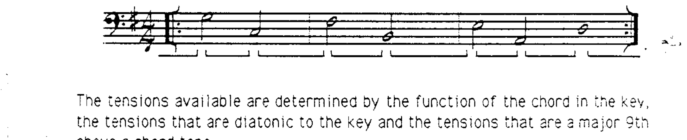
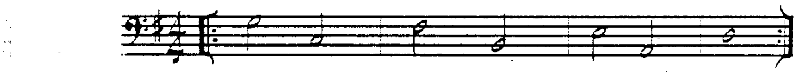
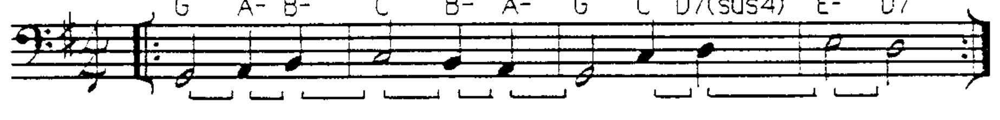
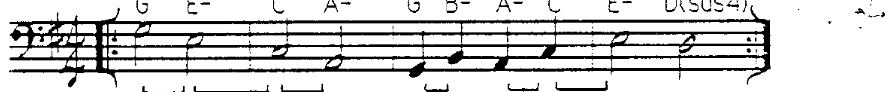
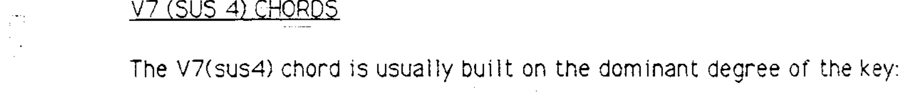
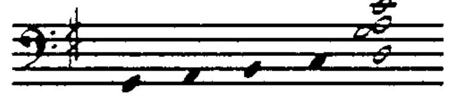
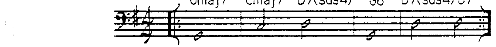
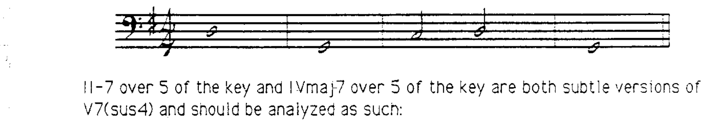

# 第 12 章 Sus4 和弦与和弦音阶

## 自然音阶和声 (Diatonic Harmony)

任何自然音阶内的和弦都可以进行到任何其他自然音阶内的和弦。控制因素是和弦**根音之间的关系**，即**根音进行 (root motion)**。根音进行分为以下几类：

---

## 根音进行的四种类型

### 1. 下行五度根音进行（最强）

最强的自然音阶根音进行是**下行五度**（即五度循环）：

> Imaj7 → IVmaj7 → VII-7(♭5) → III-7 → VI-7 → II-7 → V7

可用延伸音由和弦在调内的功能、调内音以及和弦音上方大九度规则共同决定。

**V7 到 I** 是调内最强的根音进行，因此它获得一个特殊的分析符号：

> V7 → I （箭头符号 **→** 始终用于表示属和弦下行纯五度的解决）

### 2. 下行四度根音进行（较强）

下行四度根音进行也很有力，但不及下行五度：

### 3. 级进根音进行（较为含蓄）

级进（上行或下行二度）根音进行比四度和五度进行更**含蓄 (subtle)**：

### 4. 三度根音进行

另一种自然音阶根音进行是上行或下行三度。下行比上行更常见：

在以上所有示例中，请注意和声进行是循环往复的。如果需要一个终止点，最佳的结束和弦是 **I 和弦**。I 和弦可以接任何其他和弦，因为它代表一个**和声到达点 (point of harmonic arrival)**。

---

## V7(sus4) 和弦

V7(sus4) 和弦通常建立在调的**属音级 (dominant degree)** 上：

属和弦解决的力量在于根音**下行纯五度**的进行。

由于 V7(sus4) **不包含三全音 (tritone)**，其自然音阶功能取决于上下文：

### 下属上层结构 (Subdominant Upper Structure)

V7(sus4) 和弦的另一个观察角度：由于不含三全音，其上层结构具有**下属功能 (subdominant)**，而根音是**属音**：

> II-7/属音低音 = V7(sus4)
>
> IVmaj7/属音低音 = V7(sus4)

以上两个和弦都包含一个具有下属色彩的上层结构和调的属音作为根音。

---

## 当代音乐中的常见用法

这些和弦在当代曲目中非常常见：

**II-7/属音低音**和**IVmaj7/属音低音**都是 V7(sus4) 的微妙变体，分析时应如此理解：

II-（或 II-7）/属音低音和 IV（或 IVmaj7）/属音低音可以视为从 V7(sus4) 的扩展结构中衍生出的和弦形态。
