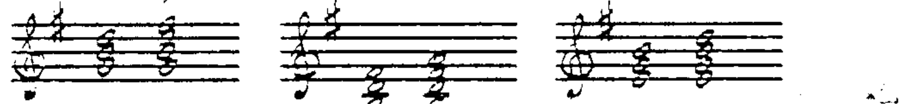
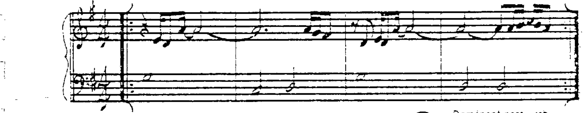
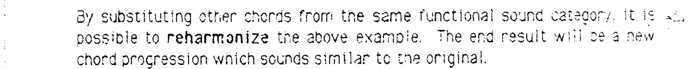
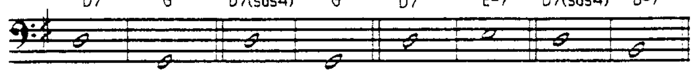
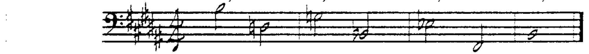
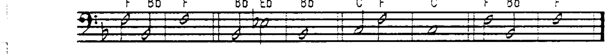
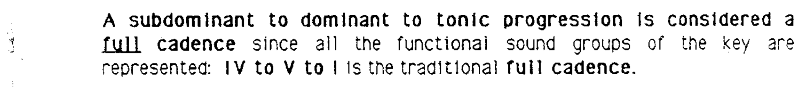
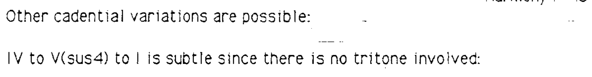
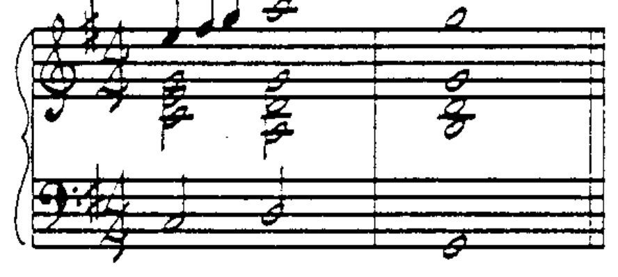
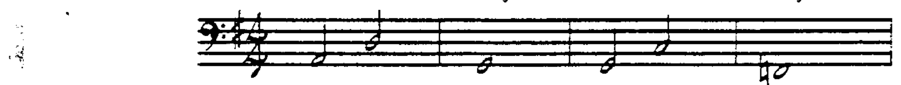

# 第 13 章 重配和声与终止式

## 自然音阶重配和声 (Diatonic Reharmonization)

自然音阶和弦根据根音在音阶中的位置有各自的名称：**I 和弦**称为**主和弦 (tonic)**，**V 和弦**称为**属和弦 (dominant)**，**IV 和弦**称为**下属和弦 (subdominant)**。

所有自然音阶和弦都可以归入以下三种功能类别之一：

| 功能 | 英文 | 和弦 |
|------|------|------|
| 主功能 (Tonic) | Tonic | Imaj7、I（三和弦）、III-7、VI- |
| 下属功能 (Subdominant) | Subdominant | II-7、IVmaj7、IV（三和弦） |
| 属功能 (Dominant) | Dominant | V7、VII-7(♭5)、V（三和弦）、VII dim |

---

## 重配和声的方法

通过用**同一功能类别中的其他和弦**进行替换，可以对原有的和弦进行进行**重配和声 (reharmonization)**。重配的结果是一个新的和弦进行，其功能走向与原版相似。

比较这两个和弦进行，需注意以下重要事实：

1. **根音进行不同**，但旋律相同。
2. **旋律与重配和声的选择必须兼容**。
3. 原来的两个属和弦解决方向不再是下行纯五度（V7 或 V7(sus4) 的正常解决方向是下行纯五度到 I 和弦）。

---

## 欺骗解决 (Deceptive Resolution)

请注意，V7 到 III-7 或 VI-7 的**欺骗解决 (deceptive resolution)** 的分析符号与 V7 到 I 的解决不同——根音进行不是下行纯五度，因此不使用箭头。

分析符号写作：**V7/I**

V7/I 表示"I 的 V7"——V7 原本应进行到 I，但实际上**欺骗性地解决 (deceptive resolution)** 到了另一个主功能和弦。

---

## 终止式 (Cadence)

**终止式 (cadence)** 指旋律和/或和声运动到达一个**休止点**的过程。该休止点就是终止式。

### 属终止式 (Dominant Cadence)

### 下属终止式 (Subdominant Cadence)

### 完全终止式 (Full Cadence)

一个**下属 → 属 → 主**的进行被视为**完全终止式 (full cadence)**，因为调的三种功能类别全部得到了体现。传统的完全终止式为 **IV → V → I**：

---

## 终止式变体 (Cadential Variations)

### IV → V(sus4) → I

由于不含三全音，这种终止式更为**含蓄 (subtle)**：

### IV → IV/属音根音 → I

更加含蓄的变体——从下属到属的转换仅涉及根音从 IV 到 V 的移动：

### II-7 → V7 → I 终止式

II-7 → V7 → I 终止式非常有力，因为所有根音进行都是**下行纯五度**。这一完全终止式的特殊变体在当代音乐中极为常用，某些风格几乎完全依赖于它：

> 例如：
> - G 大调：A-7 → D7 → Gmaj7
> - F 大调：G-7 → C7 → Fmaj7
> - B♭ 大调：C-7 → F7 → B♭maj7
> - G 大调：A-7 → D7 → Gmaj7
