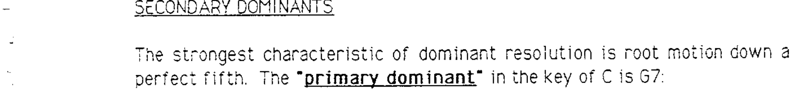
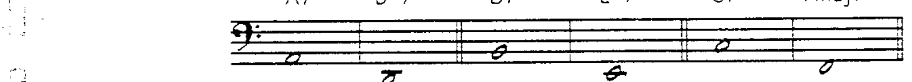
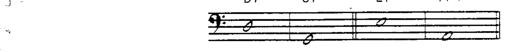
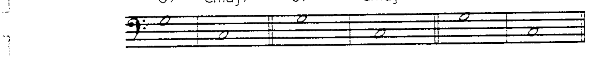
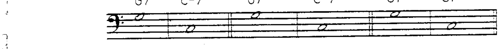
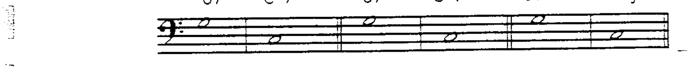
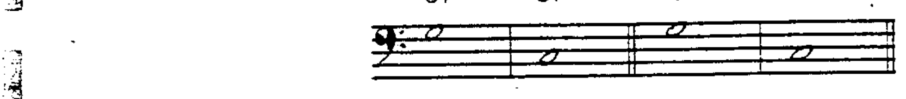

# 第 1 章 副属和弦

## 副属和弦 (Secondary Dominants)

属和弦解决最强的特征是**根音下行纯五度**。在 C 大调中，**主属和弦 (primary dominant)** 是 G7：

C 大调中的**副属和弦 (secondary dominants)** 为：

属和弦可以解决到其下方纯五度的**任何性质的和弦**，但减七和弦除外：

---

## 副属和弦的解决目标

因此，解决目标可以是大调或小调中的**任何自然音阶和弦**：

当副属和弦按预期解决（下行纯五度到自然音阶和弦）时，使用**箭头**来表示解决方向。

副属和弦的分析标记反映其预期解决的自然音阶和弦：

与 V7/I（I 的 V7）的分析类似，斜线表示"**的**"。例如：V7/II = II 的 V7。另外请注意，分析符号中**不需要**标注解决和弦的性质。

---

## 副属和弦的共同特征

所有副属和弦都具有以下共同特征：

1. 它们是**非自然音阶结构**——至少有一个和弦音不属于当前调性。
2. 它们预期解决到其下方纯五度的**自然音阶和弦**。
3. 它们都建立在**自然音阶根音**之上。

> 第三个特征（自然音阶根音）正是大调中 V7/VII 被排除在此类别之外的原因。VII-7(♭5) 上方纯五度的根音**不是**自然音阶内的音。

---

## 副属和弦的可用延伸音 (Available Tensions — Secondary Dominants)

副属和弦上的延伸音反映该和弦的**自然音阶功能**：

可用延伸音的判定标准与之前相同：**非和弦音**、属于**自然音阶内**、且位于和弦音上方**大九度**的音。然而，属和弦有一些关于"大九度在和弦音上方"规则的**重要例外**：

1. 如果 ♭9 属于自然音阶内，或和弦符号中已标注，则 ♭9 **可用**于属和弦。
2. 如果 ♭13 属于自然音阶内，则 ♭13 **可用**于属和弦。
3. ♭9 和 ♯9 可以**同时存在**于同一属和弦上，只要其中之一（或两者）属于自然音阶内。

---

### 副属和弦可用延伸音对照表

| 和弦 | 可用延伸音 | 可选延伸音 |
|------|----------|----------|
| V7/II | 9, ♭13 | ♯9（自然音阶内）及 ♭9* |
| V7/III | ♭9, ♭13 | ♯9 |
| V7/IV | 9, 13 | — |
| V7/V | 9, 13 | ♯9（自然音阶内）及 ♭9* |
| V7/VI | ♭9, ♭13 | ♯9 |

> *由于 9 和 ♯9 对于这些和弦都属于自然音阶内，两者均可使用，但**不能同时使用**。如果 ♯9 可用，则 ♭9 也可使用。
