# 第 2 章 和声节奏

## 和声节奏 (Harmonic Rhythm)

和弦进行中每个和弦所占的**拍数**称为**和声节奏 (harmonic rhythm)**。

在 4/4 拍中，最常见的和声节奏为每个和弦占 2 拍、4 拍或 8 拍：

每个和弦 2 拍的和声节奏：

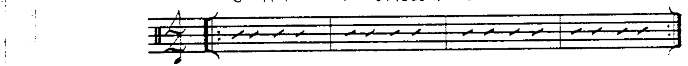

每个和弦 4 拍的和声节奏：

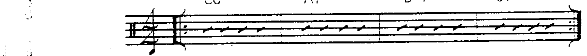

每个和弦 8 拍的和声节奏：

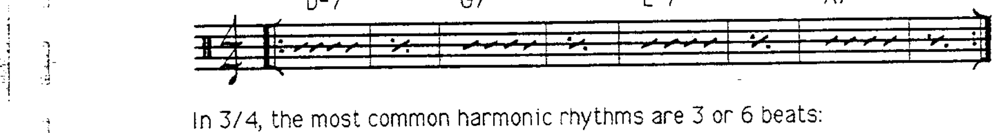

在 3/4 拍中，最常见的和声节奏为每个和弦占 3 拍或 6 拍：

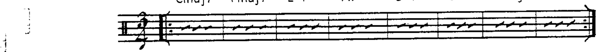

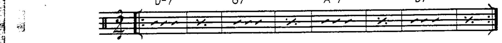

---

## 强拍与弱拍 (Strong and Weak Stress)

和弦进行中的和弦会因其在小节中的位置而获得**强拍或弱拍**的重音。这种相对的强度通常决定了和弦的功能。

在任何四个脉冲的分组中：第一个脉冲**最强**；第四个脉冲**最弱**；第二个脉冲为**弱**；第三个脉冲为**强**。

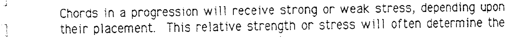

> S = 最强 (very strong)；s = 强 (strong)；W = 弱 (weak)；w = 最弱 (very weak)

此强弱拍型适用于以下各种和声节奏：

每个和弦 2 拍：

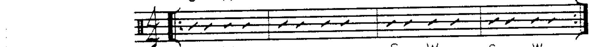

每个和弦 4 拍：

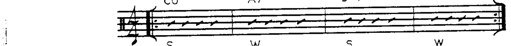

每个和弦 8 拍：

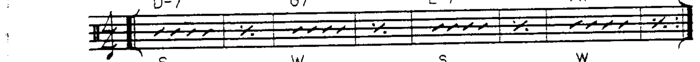

每个和弦 3 或 6 拍：

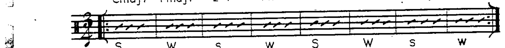

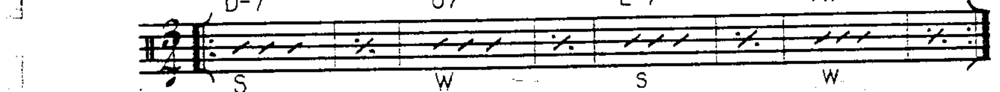

---

## 终止式与强弱拍 (Cadences and Stress)

终止式最常从**弱拍进行到更强的拍**：

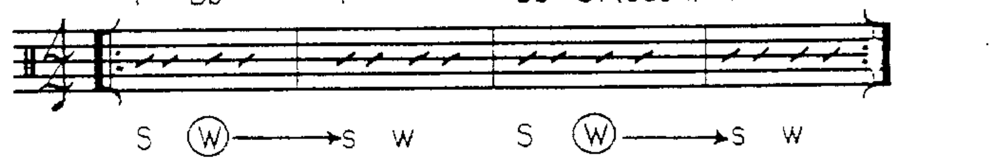

由于 V7 和弦是调内的主要终止和弦，它通常出现在**弱拍位置**：

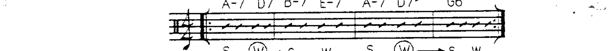

因此，**主和弦 (tonic)** 通常出现在**较强的拍位**上。

属和弦从弱拍解决到强拍的特征在**副属和弦**出现时同样成立：

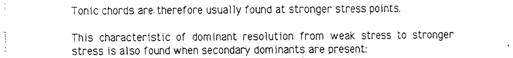

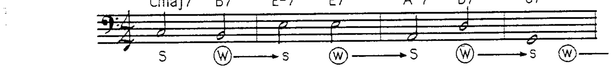

因此，除了副属和弦的其他特征外，还需补充一个观察：副属和弦通常被放置在**弱拍**上。
