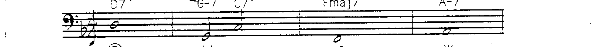
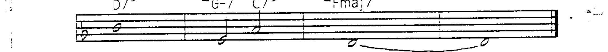
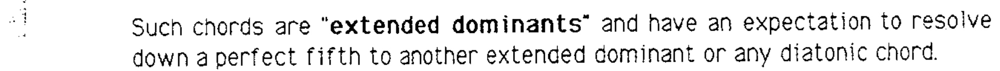
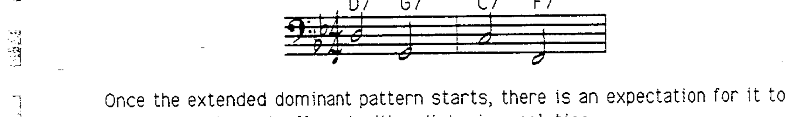
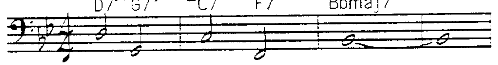
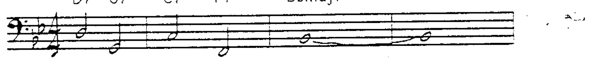
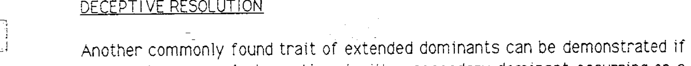
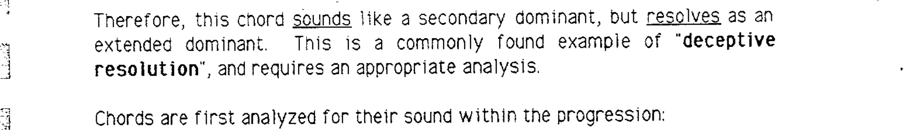
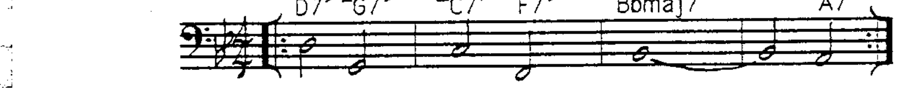
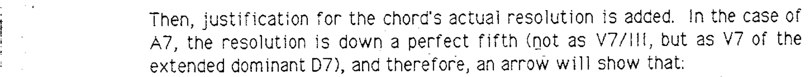

# 第 3 章 扩展属和弦

## 扩展属和弦 (Extended Dominants)

位于**强拍**上的属和弦**不会**听起来像副属和弦。这类和弦的典型位置是在乐句的开头或乐句后半部分的开头：

这类和弦被称为**扩展属和弦 (extended dominants)**，它们预期沿下行纯五度解决到另一个扩展属和弦或任何自然音阶和弦。

一旦扩展属和弦的模式开始，人们会期望它继续下去，并最终以一个**自然音阶解决**来结束：

因此，扩展属和弦具有与副属和弦**不同**的以下两个特征之一：

1. 扩展属和弦出现在**强拍**上；或
2. 它们是以扩展属和弦为起点的**属和弦连锁模式的延续**。

---

## 扩展属和弦的分析标记

扩展属和弦的分析使用**箭头**表示其下行纯五度的解决。为了标示扩展属和弦与调性的关系，**第一个扩展属和弦的根音**用罗马数字（不标和弦性质）括号标注：

每个扩展属和弦都可以被视为暂时处于与最终自然调性不同的调中：

因此，扩展属和弦链中的每个和弦在其"瞬间调性"中都充当 V7/V 的角色——除了通常最后一个属和弦（如果它在弱拍上）会听起来像主属和弦。

由于所有扩展属和弦都作为其瞬间调性或主调的 V7/V 起作用，它们的**可用延伸音为 9 和 13**，与 V7/V 相同。

---

## 欺骗解决 (Deceptive Resolution)

扩展属和弦的另一个常见特征：如果在之前的例子之后继续加入一个出现在**极弱拍**上的副属和弦：

在上下文中，A7 满足副属和弦的所有条件——它处于弱拍位置，且有可能解决到强拍。但如果脱离上下文来看，它是五度循环属和弦运动（A7 D7 G7 C7 F7）中的第一个。

因此，这个和弦**听起来**像副属和弦，但**解决方式**却像扩展属和弦。这是**欺骗解决 (deceptive resolution)** 的一个常见例子，需要适当的分析标记。

和弦首先按其在进行中的**听感**来分析：

任何欺骗解决都用**括号**标注：

> （A7 并未按 V7/III 的方式解决到 D-7。）

然后，加入该和弦**实际解决方向**的依据。A7 的解决是下行纯五度（不是作为 V7/III，而是作为扩展属和弦 D7 的 V7），因此用箭头表示：

---

## 总结 (Summary)

1. **副属和弦**是位于自然音阶和弦上方纯五度的属和弦。它们处于相对**弱拍**位置，解决和弦在更强的拍位上。分析标记为 V7/X（X 为下方纯五度的自然音阶和弦）。如果副属和弦进行了欺骗解决，分析标记加括号，并附加实际解决的标记。可用延伸音反映其**预期**解决，而非实际解决。

2. **扩展属和弦**是位于**强拍**上的属和弦，或沿五度循环进行的属和弦连锁中的一环（以扩展属和弦为起点）。分析使用箭头，第一个扩展属和弦附带其根音的罗马数字括号标注。可用延伸音为 **9 和 13**。
