# 第 4 章 旋律分析

## 旋律分析 (Melodic Analysis)

几乎所有的音乐都有一个共同特征：**重复 (repetition)**。音乐思想的重复是旋律分析的核心。

大多数歌曲形式包含一定程度的**乐句重复 (phrase repetition)**。在 **AABA 形式**中，四个乐句中有三个是相同的（或极为相似）：

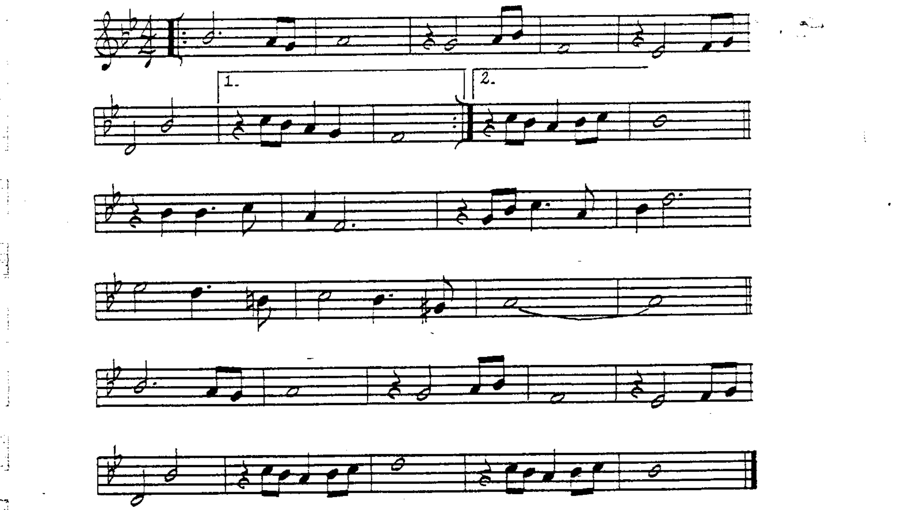

有些歌曲的重复乐句与原始乐句仅**略有不同**，这种形式记作 **AABA'**（AABA prime）。最后一个乐句与前两个足够相似，可以标记为 A'：

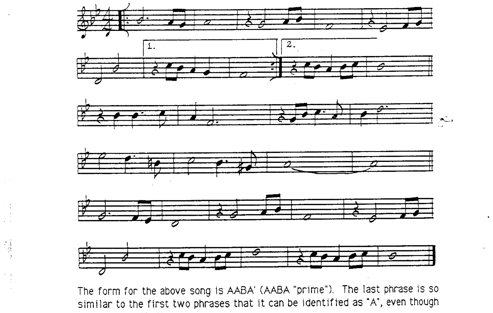

乐句重复存在于几乎所有常见曲式中：AABA、ABAC、ABA、ABCA、ABABC 等。

**旋律重复也发生在乐句内部。** 大多数乐句可以分为三个区域：

1. **前句 (Antecedent)** — 乐句的前半部分
2. **后句 (Consequent)** — 乐句的后半部分，可能以终止结束
3. **旋律终止 (Melodic cadence)** — 运动到达休止点

---

## 贯穿写作与动机 (Through-Composed Songs and Motifs)

**贯穿写作 (through-composed)** 的歌曲通过**动机的重复与变形**来实现统一性。

**动机 (motif)** 是一个音乐片段，大多数动机短于 2 小节。旋律动机可以原样或以变形方式重复出现：

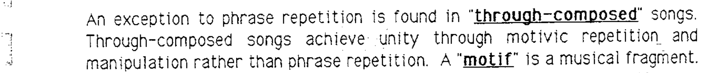

### 动机变形的五种方法

**1. 移位 / 模进 (Transposition / Sequence)**：

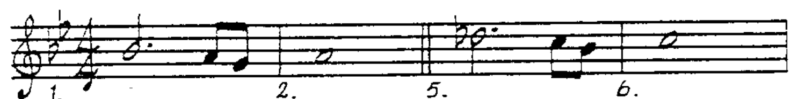

**2. 倒影 (Inversion)**：

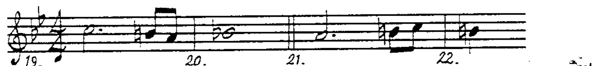

**3. 逆行 (Retrograde)**：

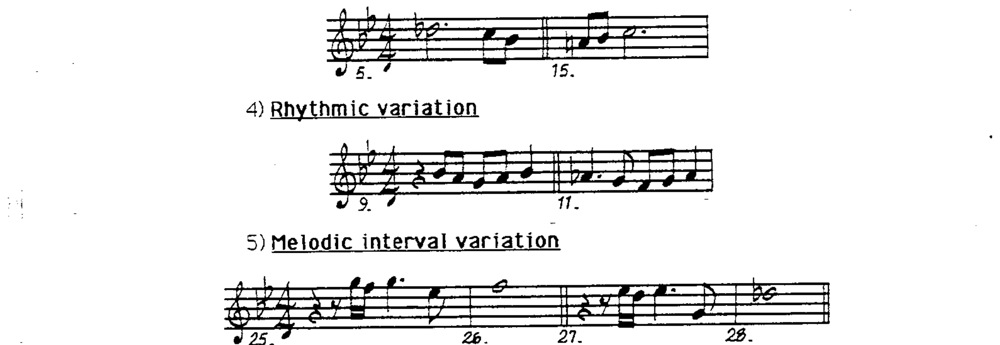

**4. 节奏变奏 (Rhythmic Variation)**：

**5. 旋律音程变奏 (Melodic Interval Variation)**：

---

## 旋律分析步骤 (Melodic Analysis Procedures)

**第一步**：确定**曲式 (song form)**。动机应使用**方括号**标出。

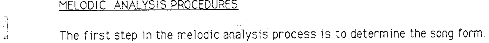

---

## 经过音与接近音 (Approach Notes and Passing Tones)

**第二步**：识别每个音与和声的关系。每个音要么是：

1. **可用音 (available pitch)** — 和弦音或可用延伸音
2. **接近音 (approach note)** — 时值不超过四分音符，以级进方式进行到和弦音或延伸音

**经过音 (passing tone)** 是在两个和弦音/延伸音之间以级进连接的接近音。属于自然音阶内的经过音标记为 **S**（scale）：

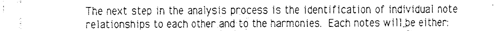

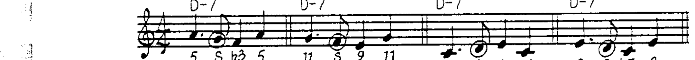

### 半音经过音 (Chromatic Passing Tones)

不属于瞬间调性自然音阶内的经过音，标记为 **Ch**（chromatic）：

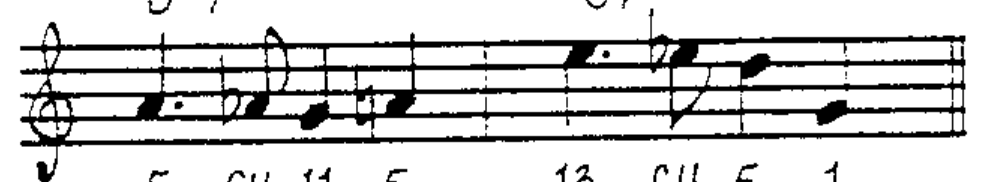

### 跨和弦解决 (Cross-Chord Resolution)

接近音可能从一个和弦开始但解决到下一个和弦。所有接近音按**解决和弦**来分析：

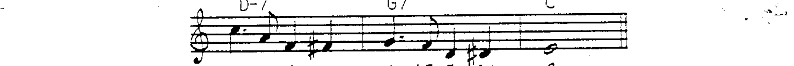

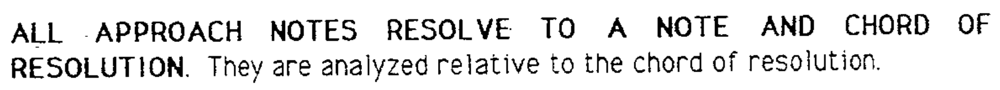

### 无准备接近音 (Unprepared Approach Notes)

没有准备音但仍须解决的接近音：

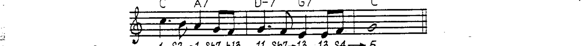

---

### 邻音 (Neighbor Tones)

从可用音上行或下行后**回到同一音**的运动：

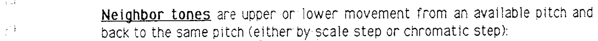

### 双半音接近 (Double Chromatic Approach)

连续同方向半音运动到解决音：

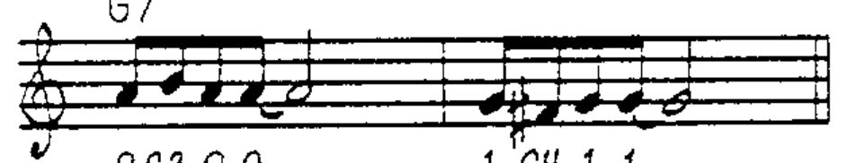

### 间接解决 (Indirect Resolution)

两个接近音分别从解决音上方和下方出发，然后解决：

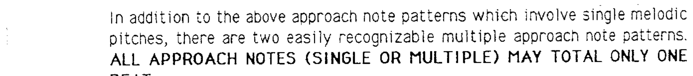

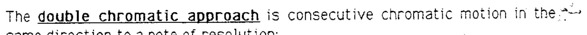

---

## 特殊旋律分析情况 (Special Melodic Analysis Situations)

### 先现音 (Anticipation)

旋律音在强拍之前**半拍**出现，按其先现的和弦来分析：

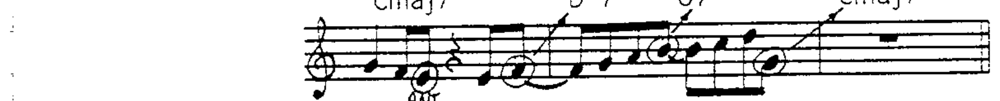

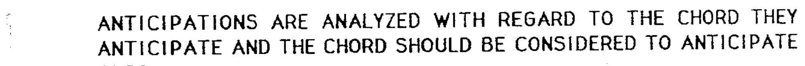

在**双倍速律动 (double time feel)** 中，先现音表现为十六分音符：

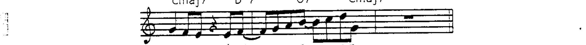

### 延迟进入 (Delayed Attack)

与先现音相反，节奏改变出现在强拍之**后半拍**：

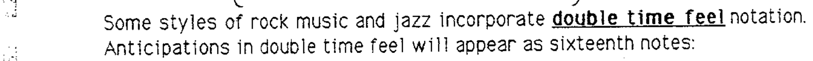

偶尔先现音和延迟进入会出现**整拍**偏移，常见于爵士作品：

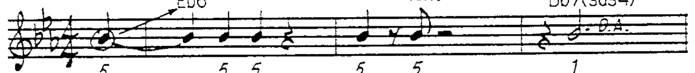

### 旋律挂留 (Melodic Suspension)

旋律音被连音线延续到不同和弦中，按挂留来源和弦的音来分析：

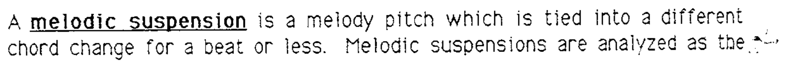

---

## 旋律分析步骤总结

1. 标注**曲式**。
2. 用方括号标出每个**动机**，标注旋律**终止**。
3. 将每个音分析为**可用音**或**接近音**（S = 音阶接近；Ch = 半音接近）。
4. 重复动机使用**重复分析**。
