# 第 5 章 声部进行

## 和声连续性与声部进行 (Harmonic Continuity — Voice Leading)

之前介绍的和弦都是**密集排列 (close position)** ——所有和弦音尽可能靠近相邻和弦音，包括原位和转位形式。

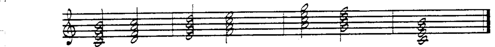

**声部进行 (voice leading)** 使和弦连接更加流畅。除根音外，和弦结构中的任何音都会按照**优先顺序**移动到后续和弦的最近和弦音：

**声部进行优先顺序：**

1. **共同音 (common tone)** — 不移动
2. **半音进行 (half-step movement)**
3. **全音进行 (whole-step movement)**
4. **三度进行 (movement in thirds)**

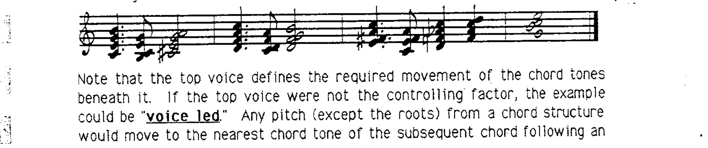

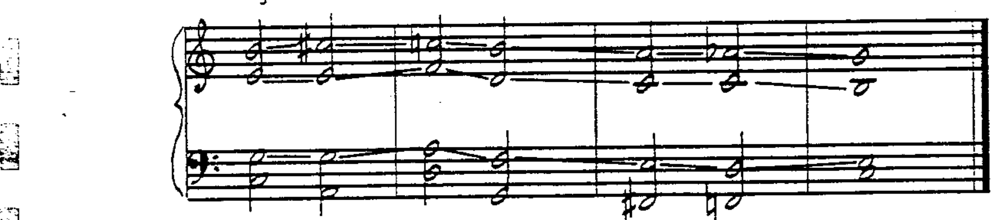

---

## 基本和弦音 (Essential Chord Tones)

当和弦进行使用声部进行连接时，便产生了**和声连续性 (harmonic continuity)**。

和弦进行也可以仅通过声部进行连接**基本音 (essential pitches)**：

- **根音 (Root)**
- **三度音 (Third)**（sus4 和弦中为四度音）
- **七度音 (Seventh)**（六和弦中为六度音）

这些音决定了和弦的大/小调性质以及七度音的类型。三度音和七度音的最佳位置在特定音域范围内：

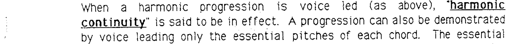

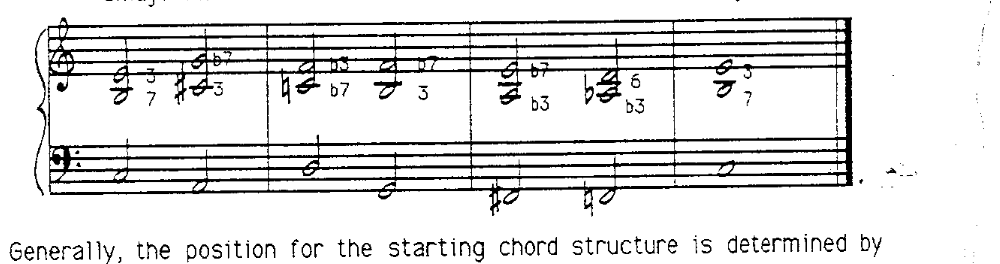

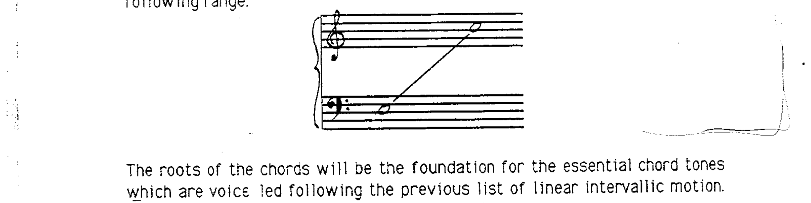

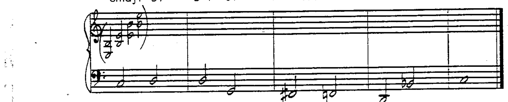

---

## 按根音运动类型分类的声部进行

### 不变根音运动 (Unchanged Root Motion)

使用共同音和/或级进声部进行。注意：与传统做法不同，在当代音乐中**平行进行 (parallel motion)** 是允许的。

### 四度与五度根音运动 (Root Motion in Fourths and Fifths)

基本和弦音通过共同音、半音或全音进行连接：

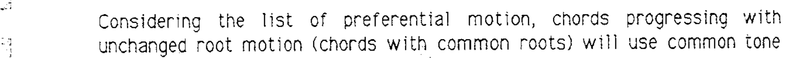

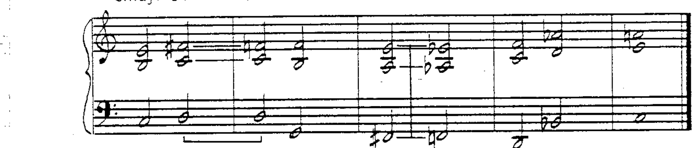

### 级进根音运动 (Step-wise Root Motion)

需要通过**平行或同向运动**进行级进声部进行：

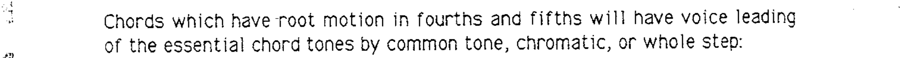

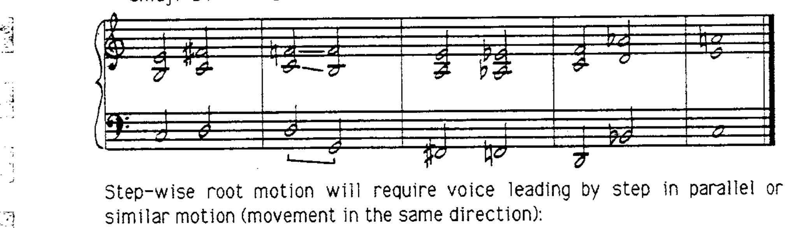

### 三度根音运动 (Root Motion in Thirds)

通常需要至少一个基本和弦音也以三度进行：

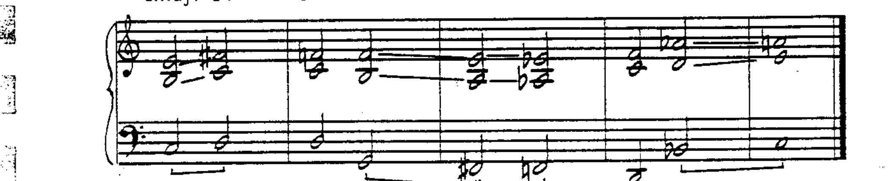

大于三度的音程声部进行通常不是必需的。

---

## 导音线 (Guide Tone Lines)

声部进行基本和弦音的结果是**根音运动**和两条**导音线 (guide tone lines)**。

导音线是通过基本和弦音的声部进行发展出的单线条，引导听众通过和弦进行：

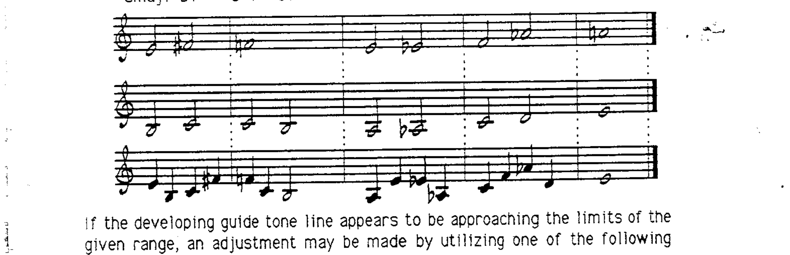

单独的导音线可以是以下三种配置之一：

1. 声部进行产生的上方线条
2. 声部进行产生的下方线条
3. 两条线的**组合**

如果导音线接近给定音域的极限，可以进行调整：

**调整方法一**：在和弦持续期间，跳到同一导音音的八度或跳到另一条导音线：

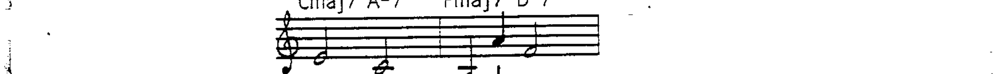

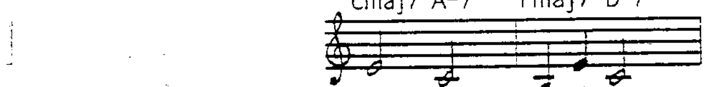

**调整方法二**：声部进行可以暂停，在终止到 I 和弦之后或乐句末尾重新开始：

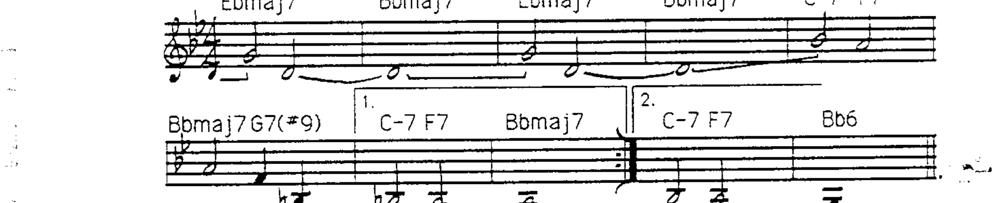

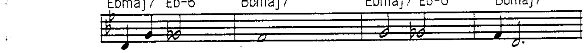

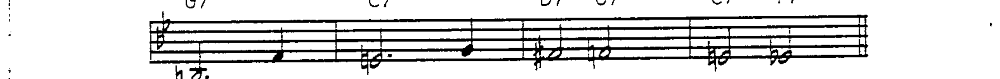

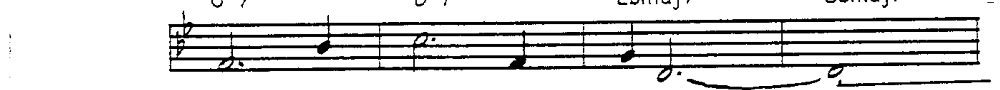

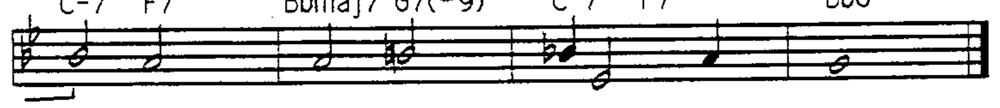
