# 第 6 章 小调和声

## 小调和声 (Minor Key Harmony)

小调和声与大调和声**相似**。小调有三种常见音阶：

1. **自然小调 (Natural minor)**
2. **和声小调 (Harmonic minor)** — 自然小调升高第 7 音
3. **旋律小调 (Melodic minor)** — 上行时升高第 6、7 音；下行时还原

---

## 自然小调 (Natural Minor)

### 自然小调的自然音阶和弦

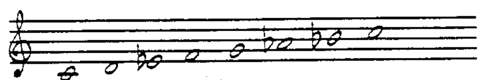

自然小调的自然音阶和弦：

| 级数 | 和弦 |
|------|------|
| I-7 | 小七和弦 |
| II-7(b5) | 半减七和弦 |
| bIIImaj7 | 大七和弦 |
| IV-7 | 小七和弦 |
| V-7 | 小七和弦 |
| bVImaj7 | 大七和弦 |
| bVII7 | 属七和弦 |

建在第 3、6、7 音上的和弦用**降号 (b)** 标注，因为它们相对于主音的位置分别是小三度 (bIII)、小六度 (bVI) 和小七度 (bVII)。

由于自然小调与关系大调共享相同的自然音阶结构，**上下文**决定了调性是大调还是小调。

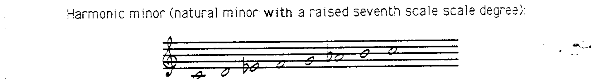

自然小调有两个重要特征：

1. 建在属音上的 **V-7 不是属七和弦结构**——它不包含三全音。
2. 具有属七结构的和弦建在**第七级 (bVII7)** 上。

因此分析中，**V-7 不使用箭头**（因为它不是属和弦）。bVII7 是**不具备属功能的属七和弦结构**。

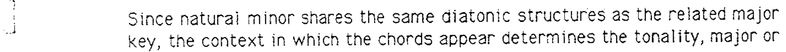

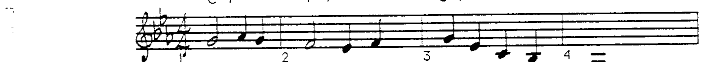

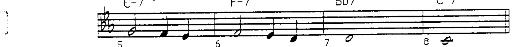

### 自然小调的典型终止式

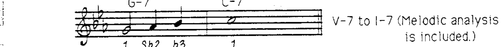

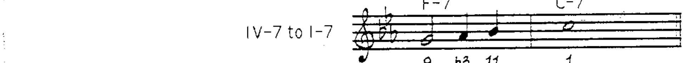

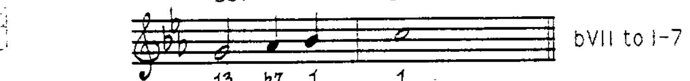

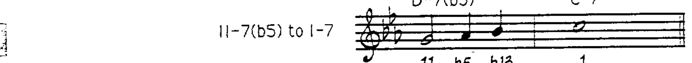

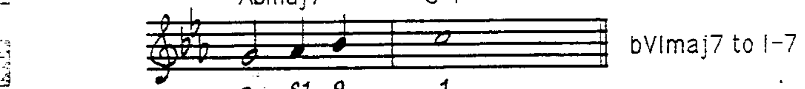

### 自然小调的可用延伸音

| 和弦 | 可用延伸音 | 可选延伸音 |
|------|----------|----------|
| I-7 | 9, 11 | 13 |
| II-7(b5) | 11 | b13 |
| bIIImaj7 | 9, 13 | #11 |
| IV-7 | 9, 11 | 13 |
| V-7 | — | 9, 13 |
| bVImaj7 | 9, #11, 13 | — |
| bVII7 | 9, #11, 13 | — |

---

## 和声小调 (Harmonic Minor)

自然小调中 V 到 I 缺乏属七解决，这促使了**和声小调**的发展。和声小调中建在第五级的和弦是**属七和弦 (V7)**。

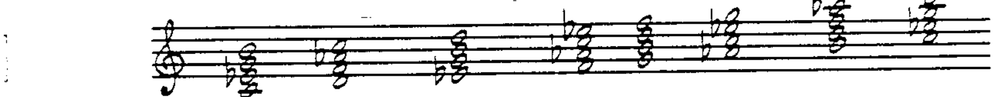

和声小调产生三个特殊的自然音阶和弦结构：

1. **I-(maj7)** — 小三和弦加大七度
2. **bIII+maj7** — 增三和弦加大七度
3. **VII°7** — 减七和弦

在和声小调中，使用**箭头**表示 V7 到 I- 的属和弦解决：

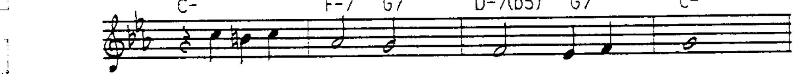

### 和声小调的典型终止式

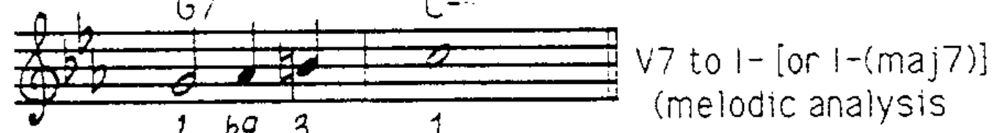

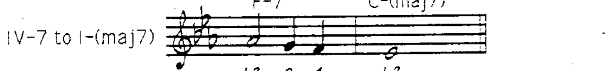

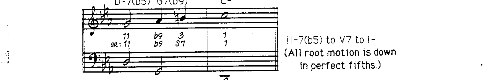

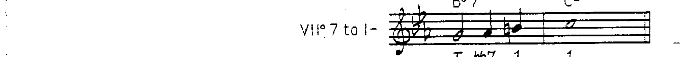

> VII°7 可以看作 V7(b9) 的上方结构。

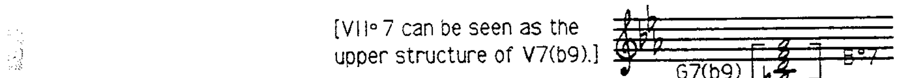

### 和声小调的可用延伸音

| 和弦 | 可用延伸音 | 可选延伸音 |
|------|----------|----------|
| I-(maj7) | 9, 11 | 13 |
| II-7(b5) | 11 | b13 |
| bIII+maj7 | 9 | #11 |
| IV-7 | 9, 11 | 13 |
| V7 | b13 | 9 或 b9 及 #9* |
| bVImaj7 | 9, #11, 13 | — |
| VII°7 | 所有可用延伸音必须属于自然音阶内且在和弦音上方大九度 | — |

> *b5 有时作为 V7 和弦的特殊和弦音使用。

---

## 旋律小调 (Melodic Minor)

和声小调的旋律由于 b6 到 7 之间的**增二度音程**而产生特殊的音响效果。传统旋律小调上行时升高第 6、7 音，下行时还原。

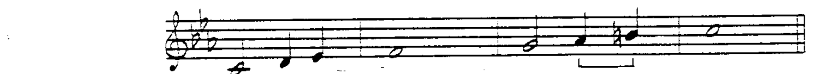

### 上行旋律小调的自然音阶和弦

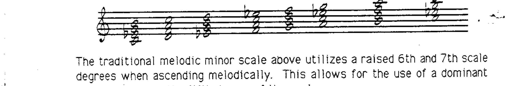

| 级数 | 和弦 |
|------|------|
| I-(maj7) | 小大七和弦 |
| II-7 | 小七和弦 |
| bIII+maj7 | 增大七和弦 |
| IV7 | 属七和弦 |
| V7 | 属七和弦 |
| VI-7(b5) | 半减七和弦 |
| VII-7(b5) | 半减七和弦 |

旋律小调的 **IV7**（类似于自然小调的 bVII7）是**不具备属功能的属七和弦结构**。

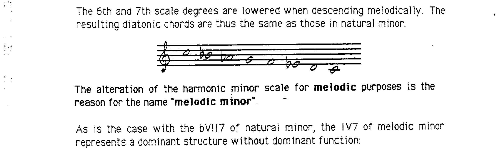

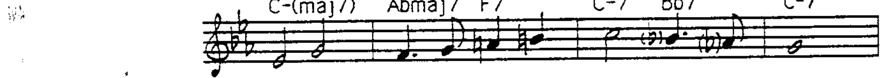

### 旋律小调的典型终止式

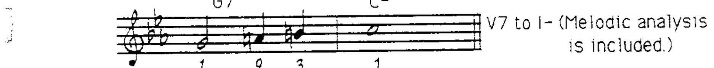

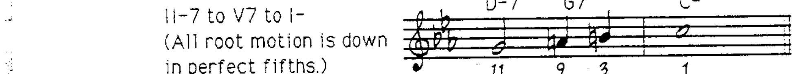

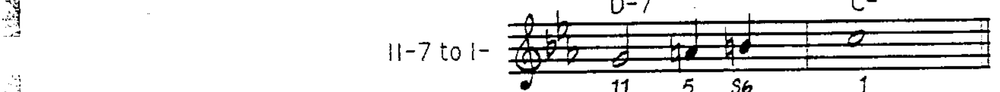

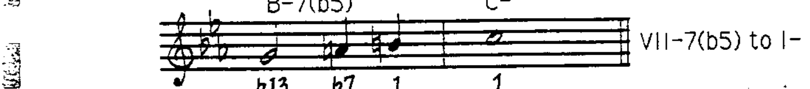

下行旋律小调的终止运动可参考自然小调的终止式。

### 旋律小调的可用延伸音

| 和弦 | 可用延伸音 | 可选延伸音 |
|------|----------|----------|
| I-(maj7) | 9, 11, 13 | — |
| II-7 | 11 | — |
| bIII+maj7 | 9, #11 | — |
| IV7 | 9, #11, 13 | — |
| V7 | b13 | 9 或 b9 及 #9* |
| VI-7(b5) | 11, b13 | 9 |
| VII-7(b5) | 11, b13 | — |

> *b5 有时作为 V7 和弦的特殊和弦音使用。
