# 第 7 章 小调中的副属和弦与扩展属和弦

## 小调中的副属和弦与扩展属和弦 (Secondary and Extended Dominants in Minor Keys)

除了自然音阶和弦外，小调和弦进行中还可以包含**副属和弦**和**扩展属和弦**。

以 D 小调为例：

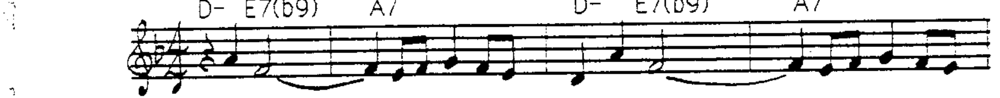

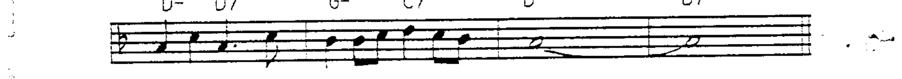

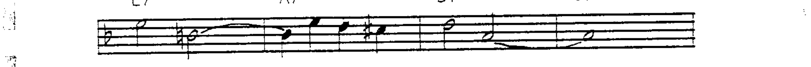

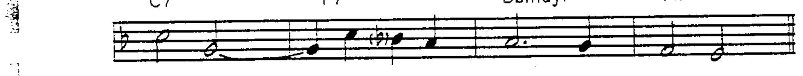

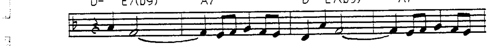

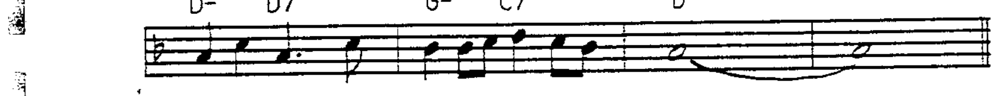

---

## 小调副属和弦的可用延伸音

扩展属和弦在小调中以"瞬间调性"运作，可用延伸音为 **9 和 13**。

副属和弦的可用延伸音属于**自然音阶内**。由于小调的第 6 和第 7 音可能升高或不升高（取决于自然、和声或旋律小调），某些副属和弦的延伸音有**不同选择**：

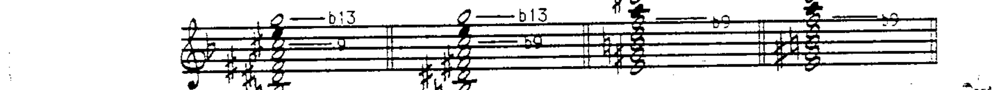

例如：V7/II (B7) 可以使用 9（来自和声或旋律小调）或 b9（来自自然小调）。V7/V (E7) 可以使用 13（和声或旋律小调）或 b13（自然小调）。

**bVII7 和 IV7** 虽然都位于某个自然音阶和弦的上方纯五度，但它们的**自然音阶功能**强于副属功能。因此它们仍保留 bVII7 和 IV7 的分析标记：

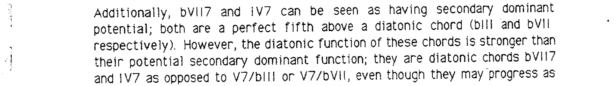

---

## 线性套式 (Line Cliches)

**线性套式 (line cliche)** 是在**单一和弦**上进行的**半音线条运动**。

经典的例子：在持续的 I- 和弦（D 小调）上，低音线半音下行穿过不同的和弦性质：I- → I-(maj7) → I-7 → I-6：

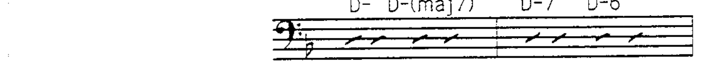

线性套式可以被识别为**单一半音线条**，而基本和弦始终是 D 小调：

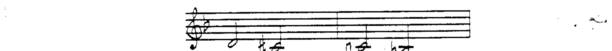

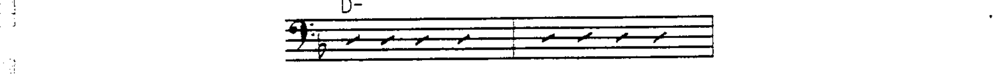

### 线性套式的特征

1. 可以出现在和弦排列的**上方、中间或下方**。
2. 可用作**导音线**或声部进行过程中的线条。
3. 始终出现在和弦**五度音以上、根音以下**的区域。

另一个常见的线性套式从和弦的五度音开始**上行**：

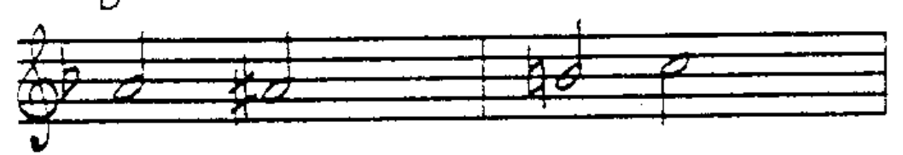

线性套式不一定始终沿同一方向运动——可以**反向**：

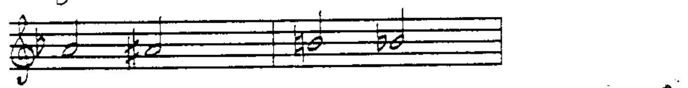

其他线性套式可以从第 6 度、b7 度或大 7 度开始：

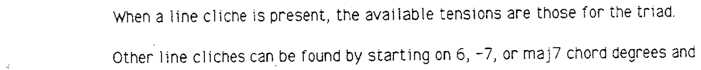

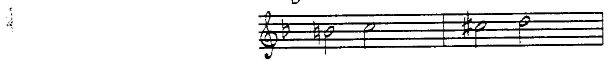

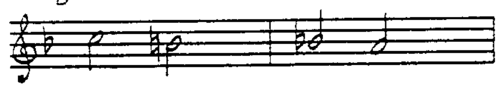

当线性套式存在时，可用延伸音为**三和弦**的延伸音（不是经过的半音和弦符号的延伸音）。

---

### 大调中的线性套式

虽然线性套式主要与小调相关，但也可以出现在**大调**中。最常见于 **I** 或 **IV** 和弦上：

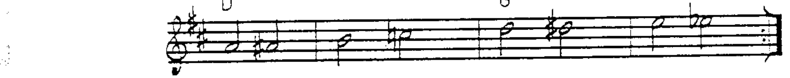

也见于 **II-**、**VI-** 或 **IV-** 和弦上：

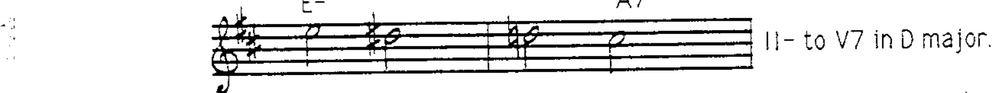

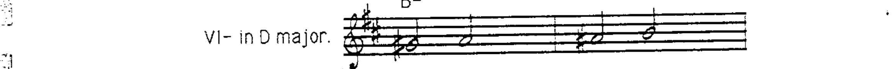

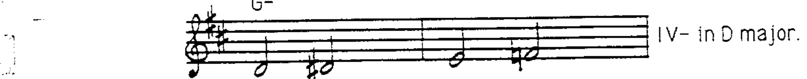
