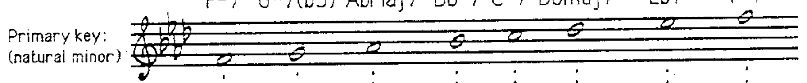
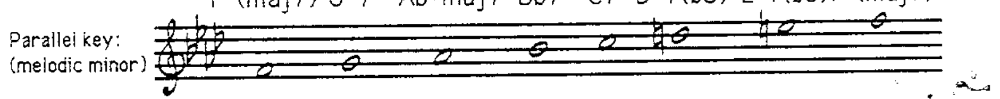
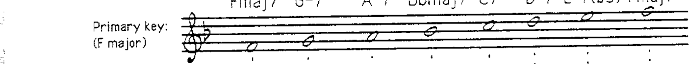
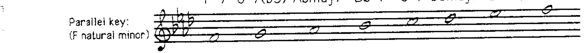
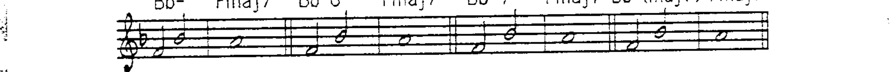
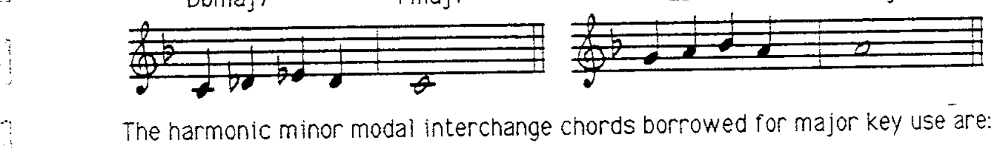
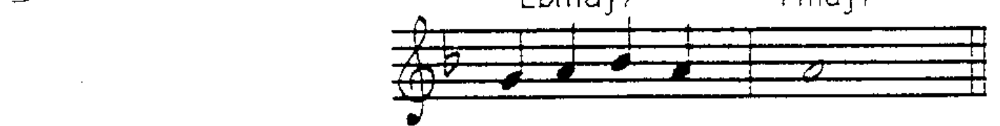
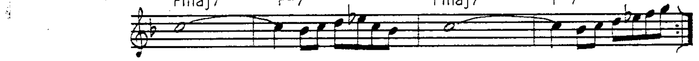

# 第 8 章 调式互换

## 调式互换 (Modal Interchange)

**调式互换是从平行调式（音阶）中借用自然音阶和弦，并在主调中使用。**

### 小调之间的调式互换

以 F 小调为例，主调为 F 自然小调，平行调为 F 旋律小调。两种小调之间可以互相借用和弦：

小调之间的调式互换是当代小调作品中**非常常见**的和声手法：

> 上例中 G-7 借自 F 旋律小调（F 自然小调中为 G-7(b5)，而非 G-7）。

---

### 大调中使用小调和弦的调式互换

在大调和声中使用**小调和弦**是调式互换最常见的应用。从**平行小调**（I- 调）借用和弦到**平行大调**（I 大调）中使用。

以 F 调为例——主调 F 大调，平行调 F 自然小调：

**自然小调的调式互换和弦：**

**IV-** 的各种形式（IV-、IV-6、IV-(maj7)、IV-7）都可以解决到 Imaj7：

**bVImaj7** 和 **bVII7** 解决到 Imaj7：

**和声小调的调式互换和弦：**

II-7(b5) → V7(b9) 解决到 Imaj7：

---

### 其他调式互换和弦

**bVIImaj7** 虽然不属于任何小调的自然音阶，但作为调式互换和弦非常常见：

**主音小调和弦**（I-、I-7）和 **bIIImaj7** 也可作为大调中的调式互换和弦：

调式互换和弦的**可用延伸音**与其在小调上下文中的标准相同。
