# 第 9 章 关系 II-7 和弦

## 关系 II-7 和弦 (Related II-7 Chords)

完整终止式由**下属 (SD) → 属 (D) → 主 (T)** 组成：

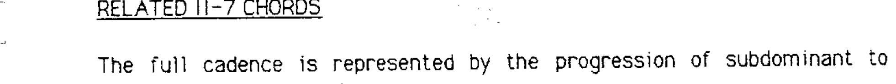

最常见的变体使用全程**下行纯五度**根音运动：

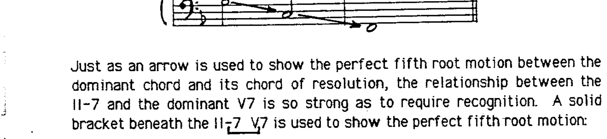

II-7 与 V7 之间的关系非常强，需要在分析中特别标识。使用**实线方括号**标记 II-7 → V7 的纯五度根音运动：

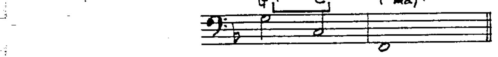

---

## 核心规则

自然音阶进行 II-7 → V7 → I 全部为纯五度运动。这种 II-7 → V7 关系非常强，因此：

> **任何属和弦都可以在其前面加上其关系 II-7 和弦。**

### 双重功能 (Dual Function)

某些副属和弦的关系 II-7 同时也是自然音阶和弦，具有**双重功能**——既作为自然音阶和弦，又作为关系 II-7 和弦。具有双重功能的和弦包括：**III-7、VI-7、VII-7(b5)**。

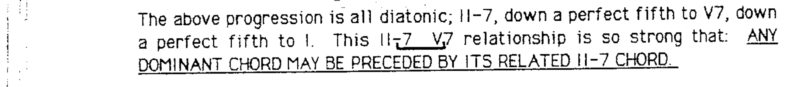

双重功能和弦的可用延伸音通常为**自然音阶内**的延伸音。

### 非自然音阶的关系 II-7

非自然音阶的关系 II-7 和弦的可用延伸音来自**瞬间调性**：

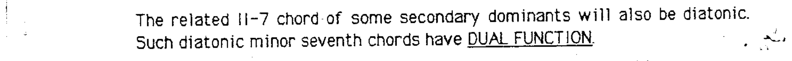

---

## 和声小调变体

方括号关系也可以表现为 **II-7(b5) → V7(b9)**（如同和声小调中）：

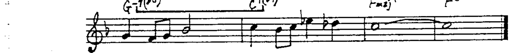

以下任何变体都不会改变 V7 的属功能：

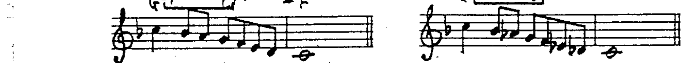

---

## 方括号的和声节奏

和声节奏直接影响 II-7 → V7 的关系。加入关系 II-7 可以**增加和声活动**而不削弱属和弦解决。

**均等和声节奏**——II-7 和 V7 各占相等时值：

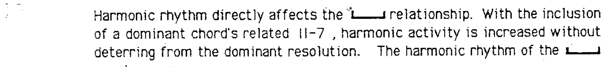

**II-7 长于 V7**：

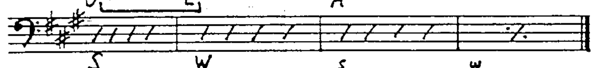

**V7 长于 II-7**（较少见）：

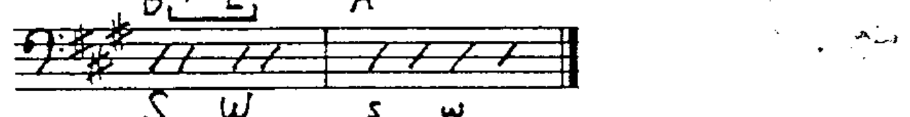

---

## 重复方括号与线性套式

**重复方括号**——II-7 → V7 可以在进行之前重复：

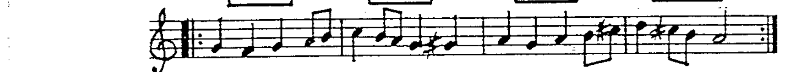

**线性套式**常出现在方括号上下文中：

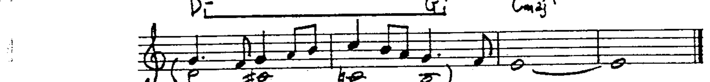

---

## 扩展属和弦的关系 II-7

扩展属和弦的关系 II-7 可以是：

**(a) 解决和弦本身**——每个 II-7 就是前一个方括号的解决目标，形成连锁：

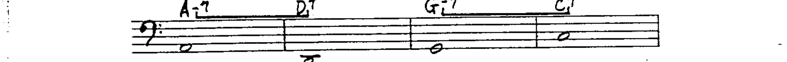

**(b) 插入式**——在每个扩展属和弦之前插入其关系 II-7：

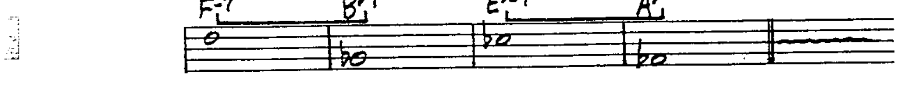
