# 第 10 章 布鲁斯

## 布鲁斯 (Blues)

布鲁斯和声源自**早期美国教会音乐**。新教教堂赞美诗中使用的主要终止式是**下属终止式**（属终止式的重要性较低）。

**变格终止 (plagal cadence)**：IV → I：

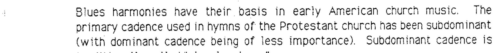

变格终止的典型音响是 **"A-men"（阿门）** 的声音，用于大多数赞美诗之后：

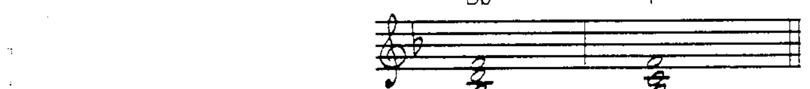

布鲁斯中的主要和弦是 **I** 和 **IV**（偶尔使用 V7）。

### 布鲁斯音阶 (Blues Scale)

布鲁斯旋律的基本音阶是**五声音阶**，但不是大调五声音阶。布鲁斯音阶**不属于**和声的自然音阶。音级为：**1, ♭3, 4, 5, ♭7**：

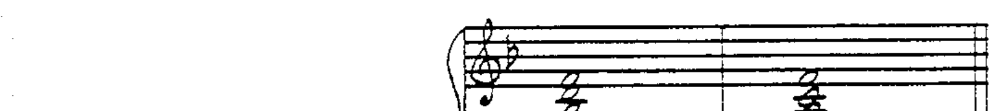

---

## 布鲁斯音符 (Blues Notes)

布鲁斯音阶与大调和声产生的关系——特别是 **♭3** 和 **♭7** 音级——创造出独特的音响，称为**布鲁斯音符 (blues notes)**。

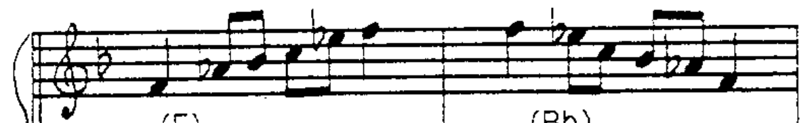

当布鲁斯旋律音叠加在基本和声结构上时，I 和 IV 三和弦变为 **I7** 和 **IV7**：

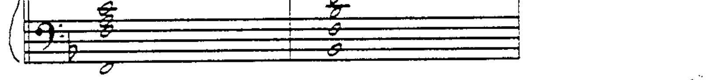

基本可用延伸音来自旋律中出现的音：

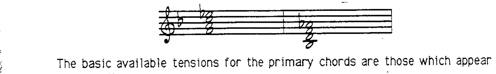

---

## 布鲁斯形式 (Blues Form)

布鲁斯形式源于**歌词即兴**的诗歌形式，基于**押韵对句 (rhymed couplet)**——对句的第一行重复（以便有更多时间即兴第二行）。

歌词的节奏可记谱为附点四分音符/八分音符，含**五个重音脉动**——即**抑扬五步格 (iambic pentameter)**。

由此产生 **12 小节形式 (12-bar blues)**：

- 第 1-4 小节：演唱歌词——对句第一行
- 第 5-8 小节：演唱歌词——第一行重复
- 第 9-12 小节：演唱歌词——对句第二行

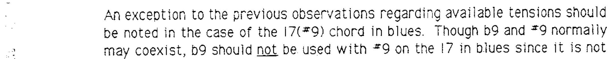

### 主要和弦的放置

I7 和弦获得最多重音，由 IV7 和弦终止到达。每个 4 小节乐句的后 2 小节以终止开始，和弦内容为 I7——这被称为 **"扫弦段 (strum)"**：

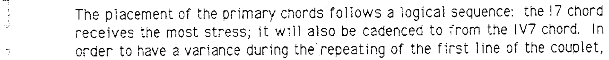

---

## 加入属和弦运动 (Adding Dominant Motion)

更高层次的复杂度是加入**属和弦运动**，融入大调和声的自然音：

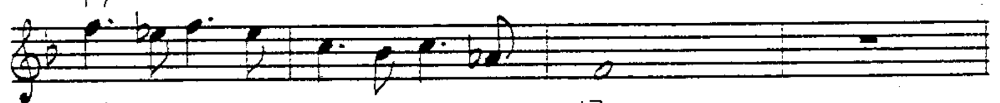

### 当代布鲁斯音阶

当代布鲁斯音阶在第 4 和第 5 音级之间加入**半音运动**（♭5 或 #4）。当代布鲁斯音符为：**♭3, ♭5(#4), ♭7**。

完整音阶：1, ♭3, 4, #4, 5, ♭7, 1：

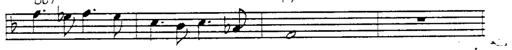

---

## 基本布鲁斯的可用延伸音 (Available Tensions — Basic Blues)

| 和弦 | 布鲁斯延伸音 | 可选大调延伸音 |
|------|------------|-------------|
| I7 | I7(#9) | I7(#9, 13) 或 I7(9, 13) |
| IV7 | IV7(9) | IV7(9, 13) |
| V7 | V7(#9) | V7(♭9, #9, ♭13) 或 V7(9, 13) |

> 注意：在布鲁斯 I7 上，♭9 **不应**与 #9 一同使用，因为 ♭9 不属于布鲁斯音阶。

---

## 布鲁斯变体 (Blues Variations)

所有布鲁斯都有一个重要特征——主要和弦在 12 小节形式中的放置：

- 第 1-4 小节：**主和弦区** (Tonic)
- 第 5-8 小节：**下属和弦 → 主和弦** (Subdominant → Tonic)
- 第 9-12 小节：**终止 → 主和弦** (Cadence → Tonic)

变体通过两种方式展现：
1. 从主要和弦出发又**回到主要和弦**的和声运动
2. **进行到下一个主要和弦**的和声运动

---

### 第 1-4 小节：主和弦区

第 1 小节为主和弦；后续和声活动会回到主和弦和/或趋向第 5 小节的下属和弦。

**III-7(♭5)** 是常见的布鲁斯和弦，出现在第 4 小节作为趋向 IV7 的和弦：

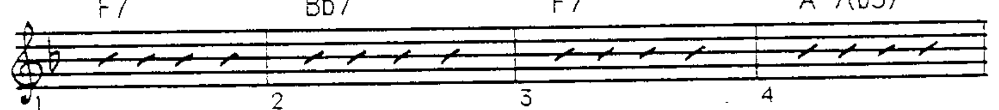

III-7(♭5) 可以看作 I9 的**上方结构**，或 V7/IV 的关系和弦：

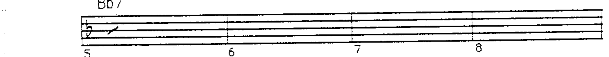

### 第 5-6 小节：下属和弦区

从下属和弦开始，包含回到下属和弦和/或趋向第 7 小节主和弦的运动。

**#IV°7** 是另一个常见布鲁斯和弦——从 IV 到 I 的趋近和弦，根音为半音解决，因此 I7 以**转位**出现：

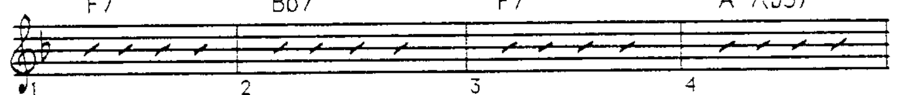

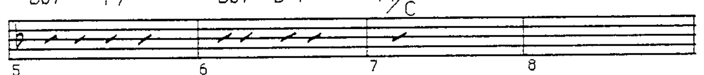

### 第 7-12 小节：终止区

第 7-8 小节从主和弦开始，运动到终止和弦。终止运动可以是**属终止、下属终止和/或从小调借用的调式互换终止**：

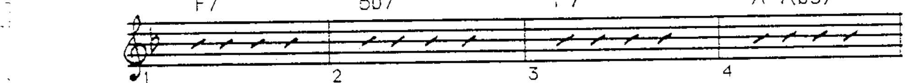

### 第 11-12 小节：回转 (Turnaround)

由于第 11-12 小节和第 1 小节都是主和弦，这里的和声运动会**回到主和弦**：

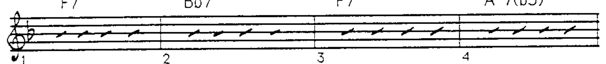

---

## IV/IV 与 bVII (Subdominant of Subdominant)

另一个当代布鲁斯和弦基于**下属终止**。进行中可以包含 IV/IV（下属的下属）：

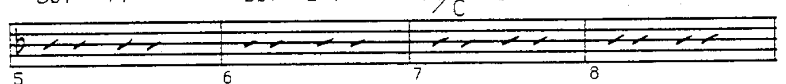

在更复杂的情况下，IV/IV 被分析为 **bVII**：

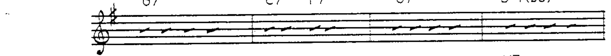

---

## 布鲁斯进行示例集

以下示例展示了各种布鲁斯进行，遵循 12 小节形式和主要和弦放置的要求。有些仅使用布鲁斯和弦，有些使用大调和声，有些使用小调和声。

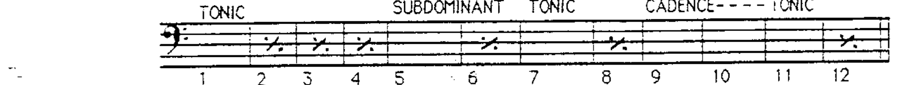

### 示例 1（基本布鲁斯）

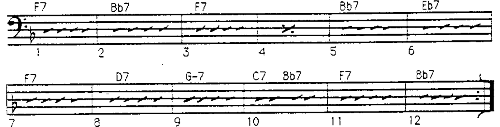

### 示例 2（小调布鲁斯）

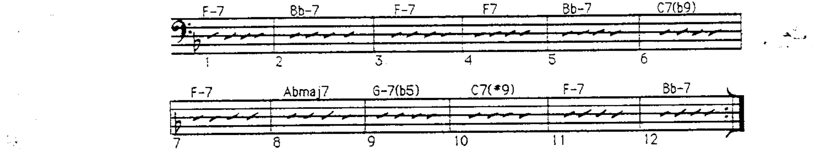

### 示例 3（大调和声）

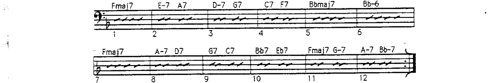

### 示例 4（变化/半音）

### 示例 5（混合）

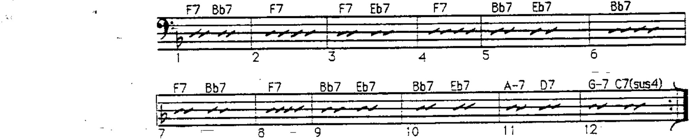

### 示例 6

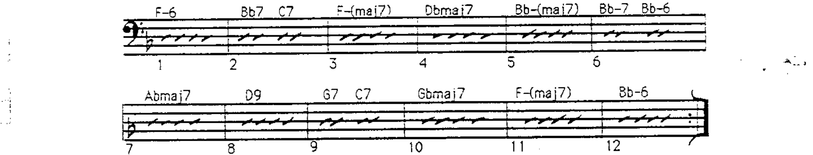

### 示例 7（小调/调式）

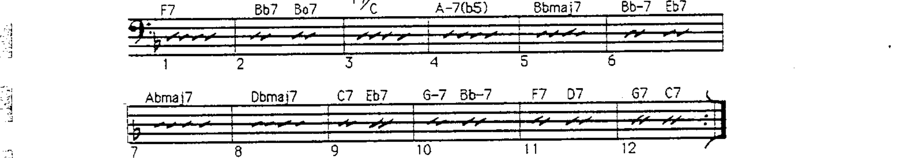

### 示例 8

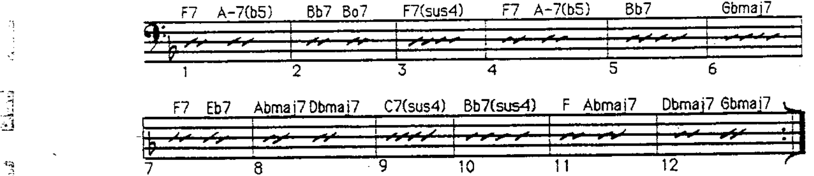

### 示例 9

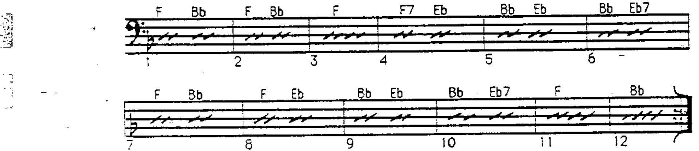

### 示例 10（三和弦/简约）

