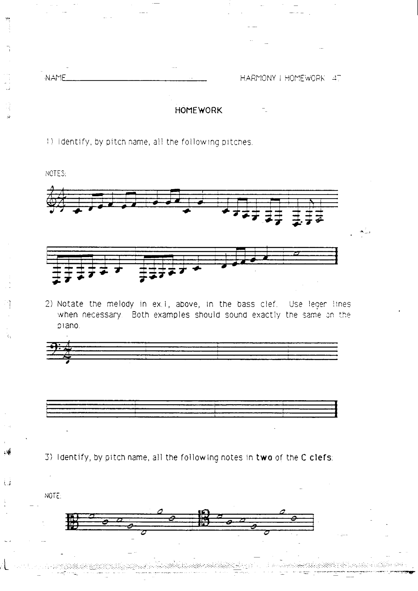

# 作业 1–3：记谱基础

> 对应章节：[第 1 章 五线谱、谱号与加线](../01-staff-clefs.md)

---

## 作业 1

辨认并写出以下所有音符的音名（高音谱号）。

---

## 作业 2

将作业 1 中的旋律用**低音谱号 (bass clef)** 重新记谱。需要时使用加线。两个版本在钢琴上听起来应完全相同。

---

## 作业 3

辨认并写出以下所有音符的音名（使用两种 C 谱号）。

