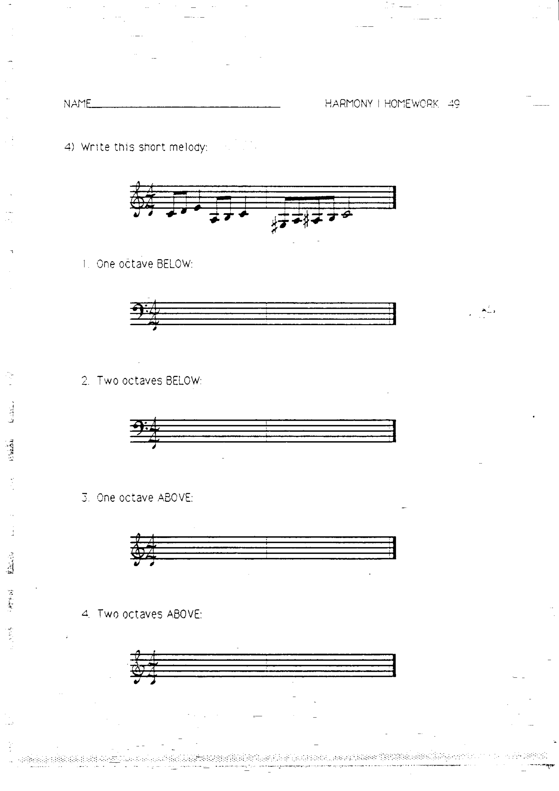
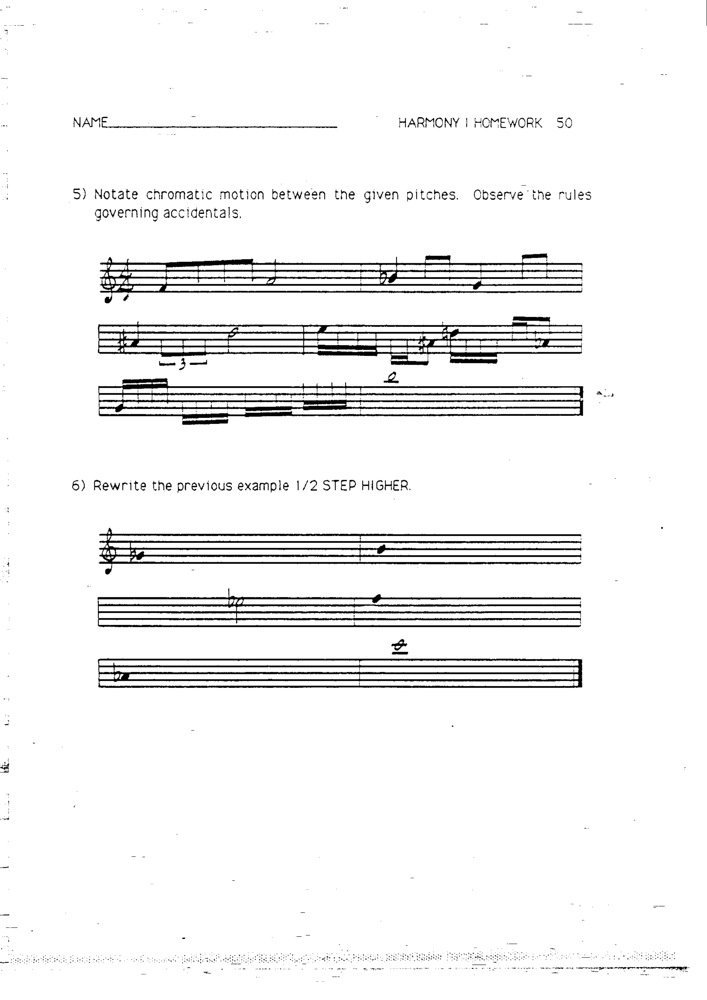
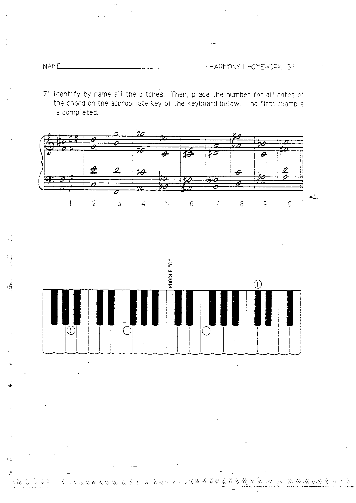
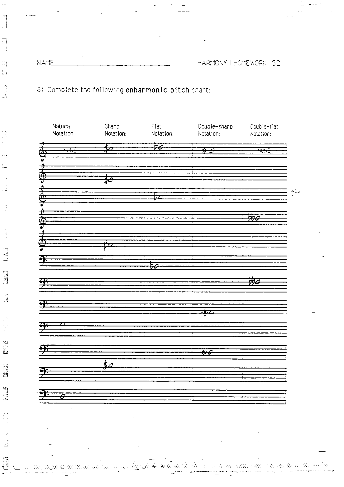

# 作业 4–8：变音记号

> 对应章节：[第 2 章 变音记号与等音](../02-accidentals.md)

---

## 作业 4

将以下短旋律分别移写到：

1. 低一个八度
2. 低两个八度
3. 高一个八度
4. 高两个八度

---

## 作业 5

在给定的两个音之间记写**半音级进 (chromatic motion)**，遵守变音记号规则。

---

## 作业 6

将作业 5 中的示例整体升高**半音**重新记写。

---

## 作业 7

辨认并写出所有音符的音名。然后，将每个和弦中的音符编号标注到下方键盘图的相应琴键上（参照已完成的示例）。

---

## 作业 8

完成以下**等音对照表**：分别写出每个音的还原、升号、降号、重升号和重降号形式的记谱。

