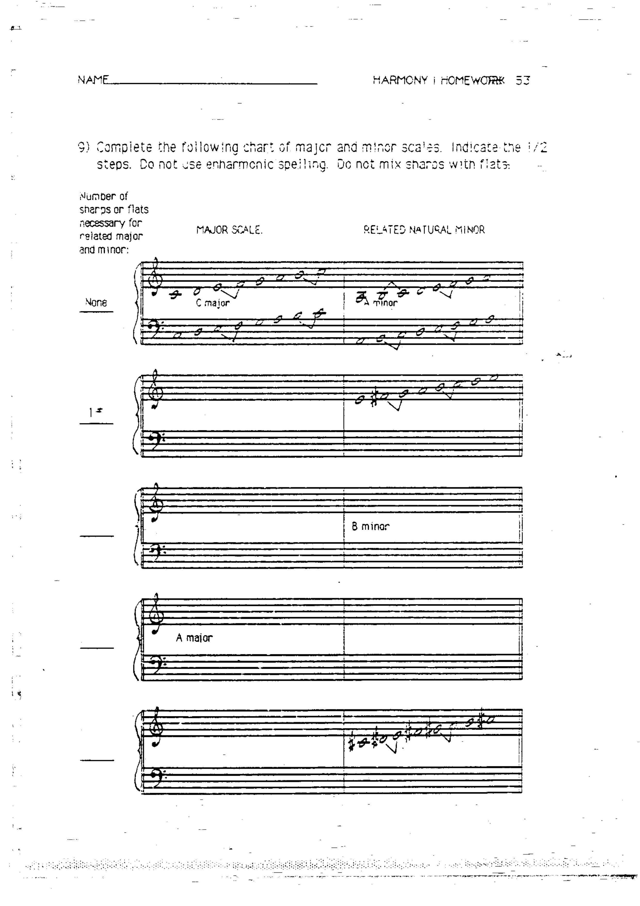
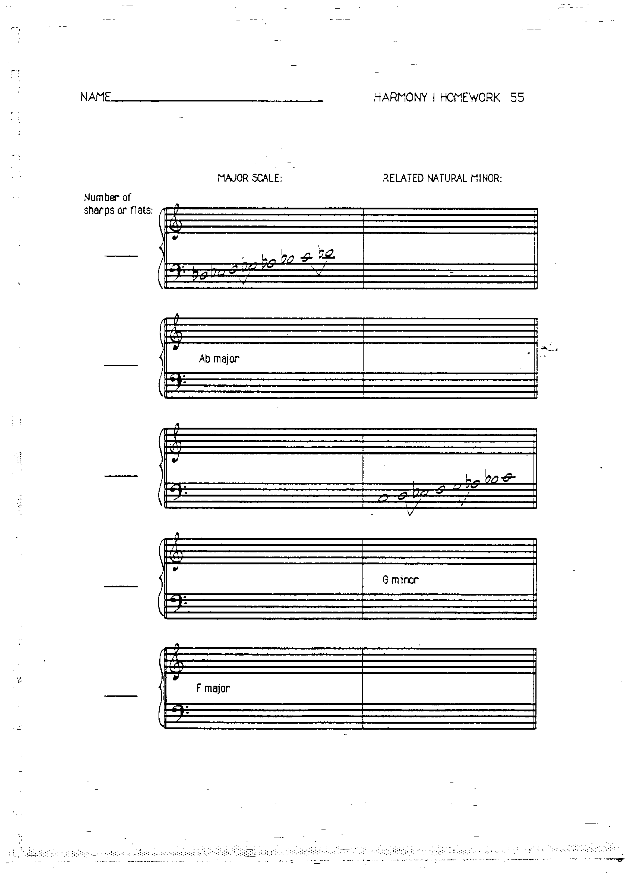

# 作业 9–10：音阶

> 对应章节：[第 4 章 音阶](../04-scales.md)、[第 5 章 小调音阶与五声音阶](../05-minor-scales.md)

---

## 作业 9

完成以下大调音阶与关系自然小调音阶对照表。标出半音的位置。不得使用等音记法，也不得在同一音阶中混用升号与降号。

---

## 作业 10

续表——完成更多大调与关系小调音阶。

