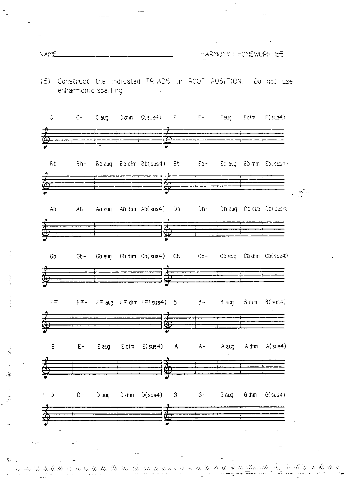
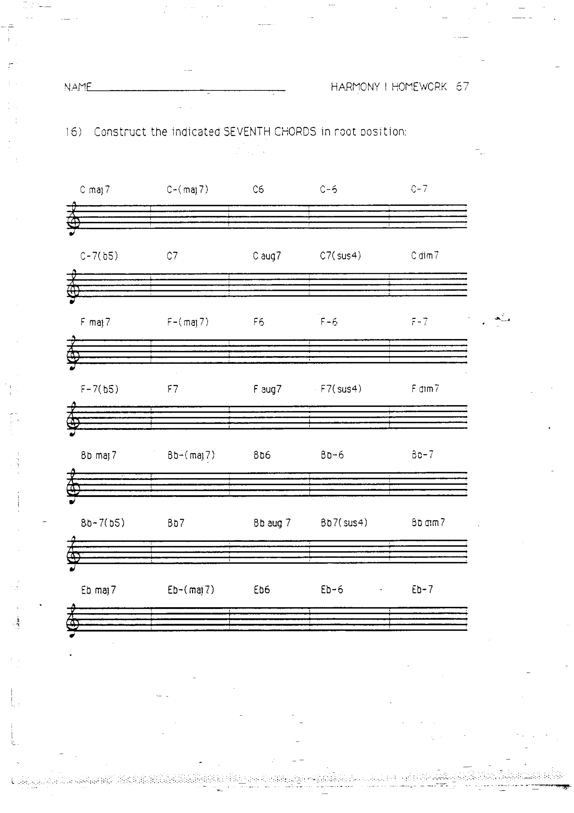
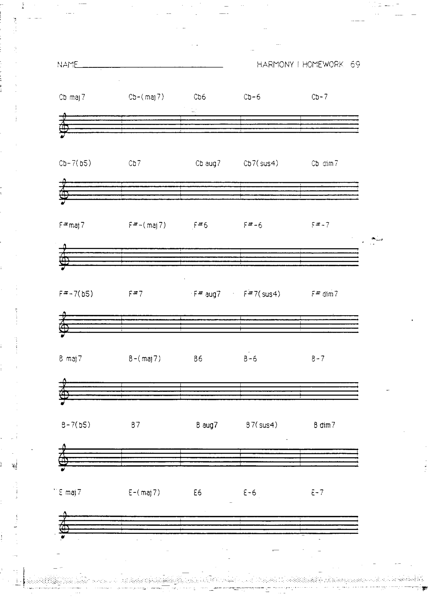

# 作业 15–17：和弦构造

> 对应章节：[第 8 章 和弦构造：三和弦与七和弦](../08-chord-construction.md)

---

## 作业 15

根据给定的根音，写出指定类型的三和弦（大、小、减、增、sus4）。

---

## 作业 16

根据给定的根音，写出指定类型的七和弦（maj7、-7、7、-7(♭5)、+7、dim7、-(maj7)、6、-6、7(sus4)）。

---

## 作业 17

辨认以下和弦并写出和弦符号。

