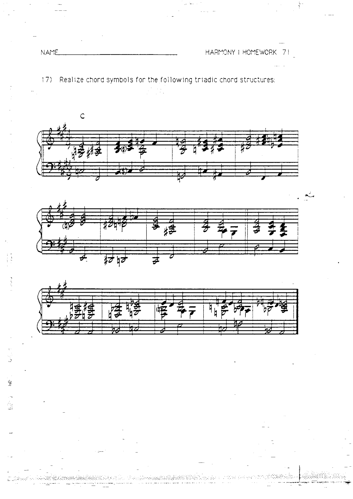
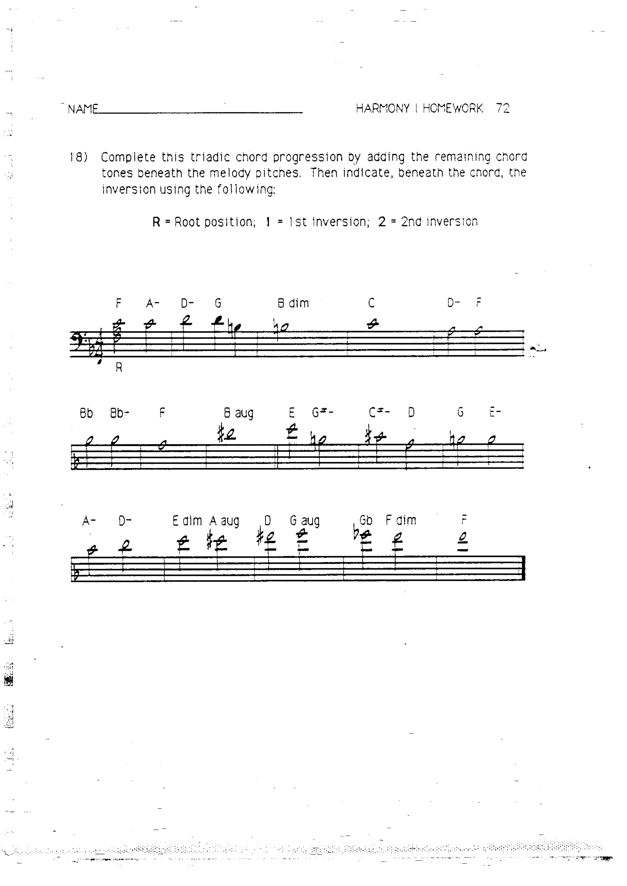
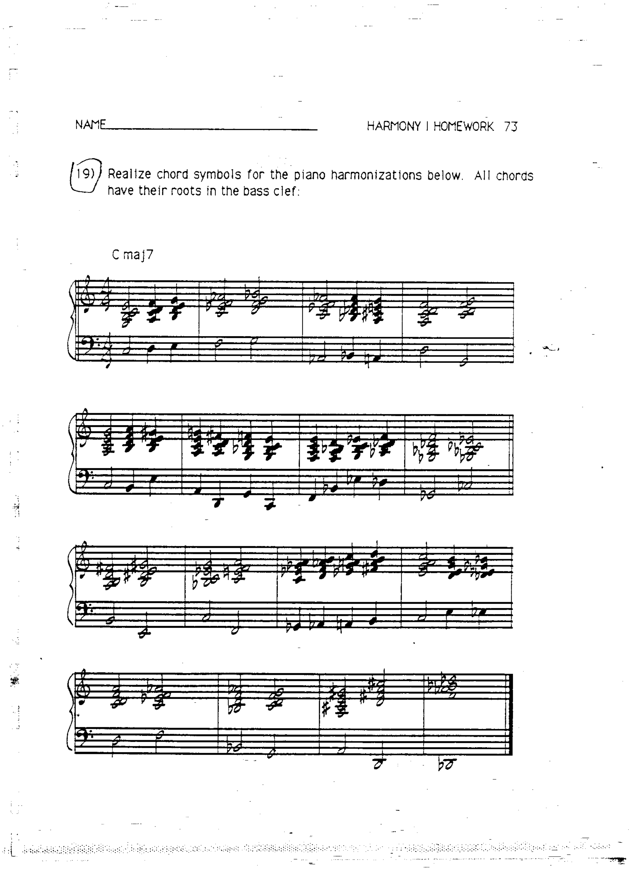

# 作业 18–20：和弦转位与自然音阶和弦

> 对应章节：[第 9 章 和弦转位](../09-chord-inversions.md)、[第 10 章 自然音阶和弦与延伸音](../10-diatonic-chords.md)

---

## 作业 18

写出以下和弦的所有转位形式（原位、第一转位、第二转位；七和弦还需写出第三转位）。

---

## 作业 19

辨认以下转位和弦，标注和弦符号并注明转位类型。

---

## 作业 20

在指定调内写出所有自然七和弦，并用罗马数字标注。

