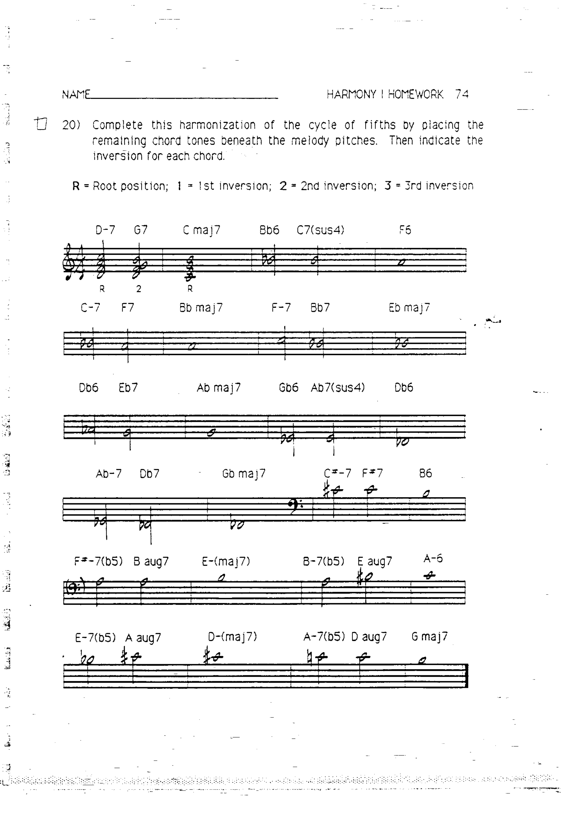
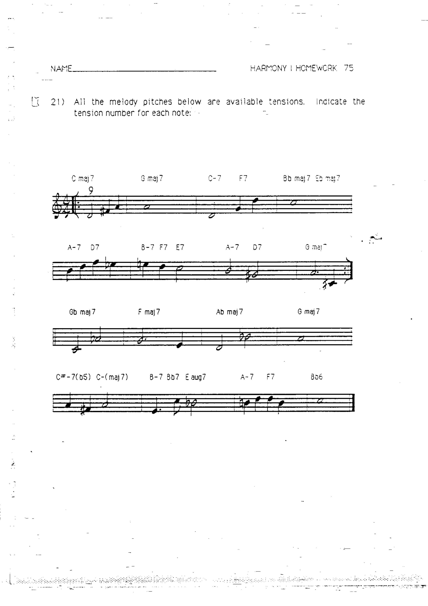

# 作业 21–22：延伸音与终止式

> 对应章节：[第 11 章 可用延伸音](../11-available-tensions.md)、[第 13 章 重配和声与终止式](../13-reharmonization-cadence.md)

---

## 作业 21

为以下和弦标注所有可用延伸音。指出哪些延伸音是和弦音上方大九度，哪些是例外情况。

---

## 作业 22

分析以下和弦进行：标注和弦功能（主、下属、属）、根音进行类型及终止式类型。

